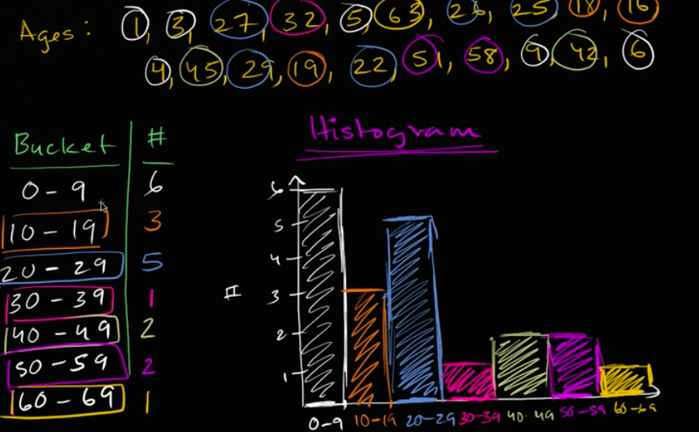
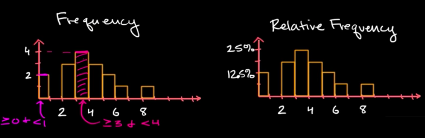

# Histogram

[Refer to Khan academy: Creating a histogram](https://www.khanacademy.org/math/ap-statistics/quantitative-data-ap/modal/v/histograms-intro)

Instead of plotting dots, Histogram put **data of categories** into **BUCKETs**.

## 「Relative Frequency Histogram」

Instead of pointing out each **category's** absolute value, sometime we need it better with each category's percentage, which `Relative Frequency` will solve the problem.

