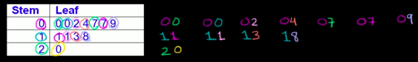
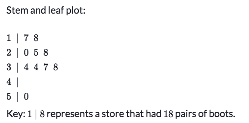

# Stem & Leaf Plot

[Refer to Khan academy review: Stem and leaf plots review](https://www.khanacademy.org/math/statistics-probability/displaying-describing-data/modal/a/stem-and-leaf-plots-review)

Both `Stem` and `Leaf` columns represents the digits (or the place) of numbers.

In the case below, `stem` shows the `tenth place digit`, and `leaf` shows the `ones place digit`.

