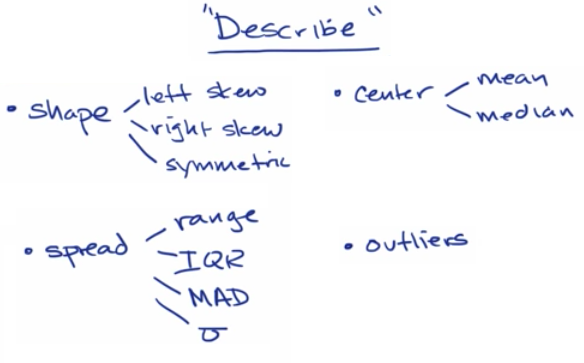
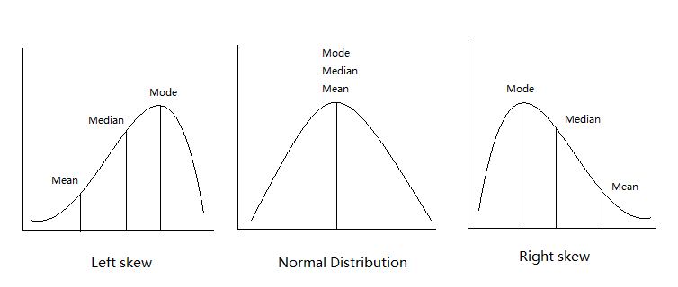
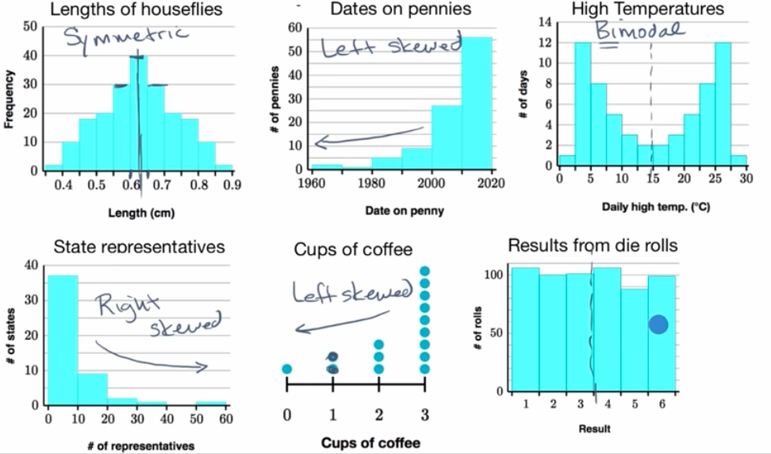
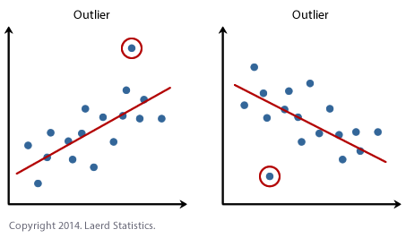
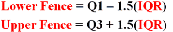
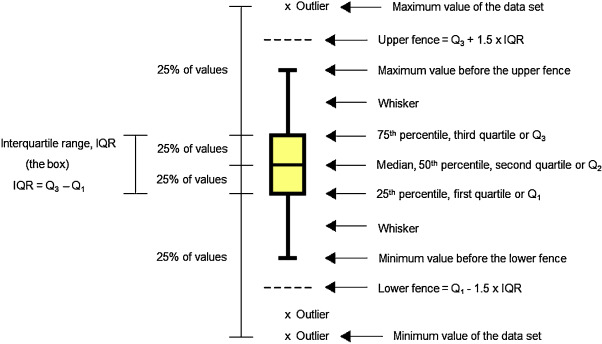

#  ❖ Describing Distributions

[Refer to Khan academy: Example: Describing a distribution](https://www.khanacademy.org/math/ap-statistics/quantitative-data-ap/modal/v/example-describing-a-distribution)

## 「Shapes」: Normal, Left Skewed, Right Skewed

[Refer to Khan academy: Classifying shapes of distributions](https://www.khanacademy.org/math/ap-statistics/quantitative-data-ap/modal/v/classifying-distributions)

- `Normal Distribution` (Symmetric distribution)
- `Left Skewed Distribution`
- `Right Skewed Distribution`
- `Uniform`
- `Bimodal Distribution`

### Example

## 「Spread」: Range, IQR, Standard Deviation, MAD
[Refer to Crash course: Measures of Spread: Crash Course Statistics #4](https://www.youtube.com/watch?v=R4yfNi_8Kqw)

- `Range`: (Highest value - Lowest value)
- `IQR`: (Q3-Q1)
- `Standard Deviation`: σ (sigma)
- `Mean absolute deviation` (MAD)

## 「Centres」: Mean, Median, Mode

[Refer to Crash course: Mean, Median, and Mode: Measures of Central Tendency: Crash Course Statistics #3](https://www.youtube.com/watch?v=kn83BA7cRNM)

- `Mean` is just an average of all numbers listed.
- `Median` is the middle positioned number in a ordered `number set` (means no duplicates). If there're two middles, then average them to get a median number.
- `Mode` is the number shows up most times in a list.

## 「Outliers」
[Refer to Khan academy: Judging outliers in a dataset](https://www.khanacademy.org/math/ap-statistics/summarizing-quantitative-data-ap/modal/v/judging-outliers-in-a-dataset)

In statistics, an outlier is an observation point that is distant from other observations.
That being said, `outliers` in a graph are the **`MINORITY`** of the values.

### Statistical definition 「1.5·IQR Rule」

Outliers are the value fall out of the `Fence`, which the `Upper fence` and `Lower fence` are:

## How to choose proper methods

We got different ways to describe the spread, centre and deviation, so we need some strategy to decide which one to use in different cases.

- For Normal Distribution: we use `Mean` as centre, `Standard Variance` as spread
- For Skewed Distribution: we use `Median` as centre, `IQR` as spread
