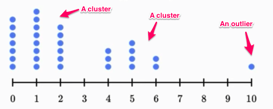
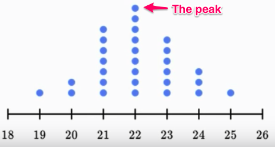

#  ❖ 「Clusters」, 「Outliers」, 「Gaps」, 「Peaks」

[Khan lecture: Shape for distributions.](https://www.khanacademy.org/math/cc-sixth-grade-math/cc-6th-data-statistics/cc-6-shape-of-data/v/shapes-of-distributions)
[Khan lecture 2 `Clusters`, `gaps`, `peaks` & `outliers`.](https://www.khanacademy.org/math/cc-sixth-grade-math/cc-6th-data-statistics/cc-6-shape-of-data/v/examples-analyzing-clusters-gaps-peaks-and-outliers-for-distributions)

- Cluster: A group of values sticks together away from other groups.
- Outliers: Some **Minority values** much away from the crowd (Majority).
- Peaks: Highest value in the distribution.
- Gaps: The ''large'' open space between some data points.
 

