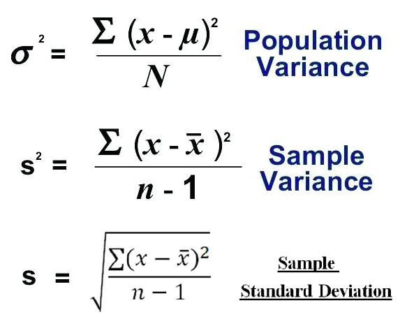
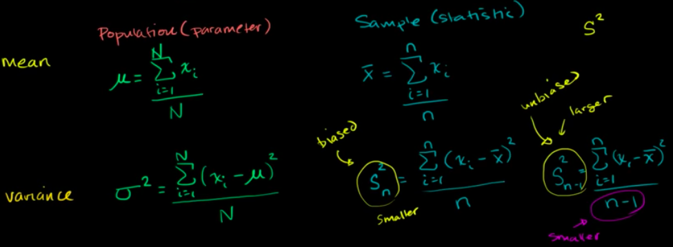
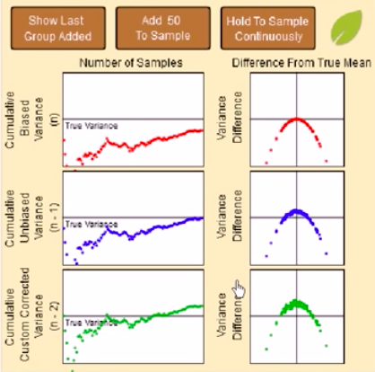

# Sample Variance

> It's also called the `Unbiased estimate of population variance`.

[Refer to Khan academy: Sample variance](https://www.khanacademy.org/math/ap-statistics/summarizing-quantitative-data-ap/modal/v/sample-variance)

For a large population, it's impossible to get all data. So we want to take out a number samples and calculate its variance.

The formula for `Sample Variance` is a bit twist to the `population variance`: let the dividing number subtract by 1, so that the variance will be **slightly bigger**.

It seems like some voodoo, but it's reasonable. If we use the `population variance formula` for **sample data**, it's **always** gonna be **underestimated**.
That's why for sample variance we should do a bit change to the previous one.

## Why we divide by n-1 for the Unbiased Sample Variance

[Refer to Khan academy: Review and intuition why we divide by n-1 for the unbiased sample variance](https://www.khanacademy.org/math/ap-statistics/summarizing-quantitative-data-ap/modal/v/review-and-intuition-why-we-divide-by-n-1-for-the-unbiased-sample-variance)
[Refer to Khan academy: Why we divide by n-1 in variance](https://www.khanacademy.org/math/ap-statistics/summarizing-quantitative-data-ap/modal/v/another-simulation-giving-evidence-that-n-1-gives-us-an-unbiased-estimate-of-variance)
[Refer to Khan academy: Simulation showing bias in sample variance](https://www.khanacademy.org/math/ap-statistics/summarizing-quantitative-data-ap/modal/v/simulation-showing-bias-in-sample-variance)
[Refer to Khan academy simulation: Unbiased Estimate of Population Variance](https://www.khanacademy.org/computer-programming/unbiased-estimate-of-population-variance/1169428428)

Simulation for different variance formulas with true variance:

