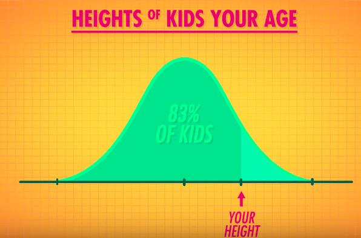
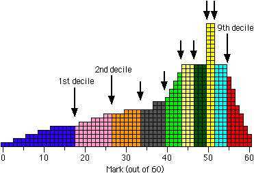
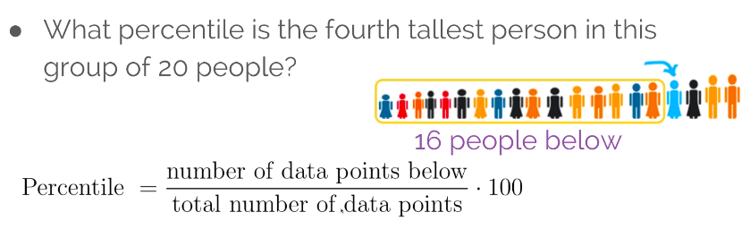
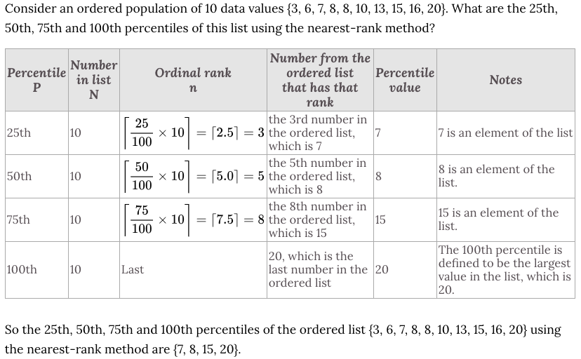
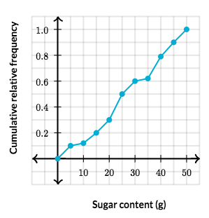

#  ❖ Percentiles

> Before start you probably need to know: explanations of `percentiles` are quite confusing and different from each teacher teaches and different at each website you searched. Because there is NO standard definition of percentile.

Percentiles tell you what PERCENTAGE of the population has a value that's **LOWER** than yours.

[`▶︎ Jump over to have practice: Calculating percentiles`](https://www.khanacademy.org/math/ap-statistics/density-curves-normal-distribution-ap/modal/e/calculating-percentiles)

[Refer to Khan academy: Calculating percentile](https://www.khanacademy.org/math/ap-statistics/density-curves-normal-distribution-ap/modal/v/calculating-percentile)
[Refer to youtube: Percentiles - Introductory Statistics](https://www.youtube.com/watch?v=mDJvDRvvDXo)
[Refer to youtube: Percentile](https://www.youtube.com/watch?v=RQ_PWoL6rcw)
[Refer to textbook [PDF]: PERCENTILES AND PERCENTILE RANKS](https://harding.edu/sbreezeel/460%20files/statbook/chapter5.pdf)
[Refer to wikipedia: Percentile](https://www.wikiwand.com/en/Percentile#)
[Refer to wikipedia: Percentile rank](https://www.wikiwand.com/en/Percentile_rank)
[Refer to mathisfun: Percentiles](https://www.mathsisfun.com/data/percentiles.html)
[Refer to pbarrett: percentiles (PDF)](http://www.pbarrett.net/techpapers/percentiles.pdf)
[Refer to varsity tutors: percentiles](https://www.varsitytutors.com/hotmath/hotmath_help/topics/percentile)

A `percentile` is all values **BELOW** the given percentage. etc., the `20th percentile` is all values below which 20% of the observations may be found.

> Percentiles are numbers from 1st to 100th, which 100th percentile means the largest value in the set.
According to wiki, there COULD be decimal percentiles such as 0.13th percentile, 2.28th percentile.

For example, if your doctor tells you: your height is AT the 83% **percentile** of population, it means there's 83% of people are shorter than or equal to yours:

## Other names of Percentiles

**`Interquartile`**:
- 25ᵗʰ percentile = Q1
- 50ᵗʰ percentile = Q2 = Median
- 75ᵗʰ percentile = Q3

**`Deciles`**:
Deciles are percentiles divided into 10 equal sections, which correspond to the 10th, 20th, 30th,...90th percentiles. 

## 「Percentile Rank」

`Percentile rank` is usually in a context of asking you to find a given value is at which percentile.
i.e., Percentile ranks are commonly used to clarify the interpretation of scores on standardized tests. 

> etc., you're asked what is the percentile rank of number 79 in a list, and the answer might be "Its rank is 90, because it's at the 90th percentile."

### 「Percentile」 vs. 「Percentile Rank」

`Percentiles` and `Percentile Ranks` are highly similar(confusing) statistics. 
- `Percentiles` are used to determine where to draw the line between observed values within the distribution. 
(etc., a teacher wants to divide his class in half according to students' scores. And he needs to find out **which score** could be **AT** 50th percentile so that he can divide them.)
- `Percentile rank` is kind of **reversed** process: It is used to determine where a particular score or value fits within a broader distribution. 
(etc., A student receives a score of 75 out of 100 on an exam and wishes to determine which percentile he is at compares to the rest of the class. )

### Example

## 「Calculate Percentiles」

The process of calculating percentiles, is actually **manipulating the indexes** of the number list. It's like calculating the **pointer**, finding out the right pointer will lead you to the number, regardless to what number it is.

There're a few methods for calculating percentiles:
- `Interquartile method`: For 25th = Q1, 50th = Q2 (or Median), 75th = Q3.
- `The nearest-rank method`: The most often used method.
- `The linear interpolation between closest ranks method`
- `The weighted percentile method`

### Formula

(`Index` is the value at given percentile, which , `P` is the percentile, `Amount` is the number of values in the list)
For cut down confusion, we use `index` instead of `Rank` from textbooks, which regards to the "ordinal rank" not "percentile rank".

### Example
There's a 12 numbers list, {a,b,c,d,e,f,g,h,i,j,k,l}
then 80th percentile relates to 80% of the **AMOUNT** of the list, 
then it's `80% × 12 = 9.6` , which `9.6` is the **index** of the number in list.
But the **index** must be a whole number, 
so according to the definition of percentile, the number must be equal or above 80% of all values,
that's being said, the **index** of number is higher than "9.6", which is the `10th` number in list.
So the 10th number in list is AT the 80th percentile, regardless what number it is.

### Example
Consider the ordered list `{15, 20, 35, 40, 50}`, which contains 5 data values. What are the `5th, 30th, 40th and 100th percentiles` of this list using the `nearest-rank method`?
[Refer to wiki: Worked examples of the nearest-rank method](https://www.wikiwand.com/en/Percentile#/Worked_examples_of_the_nearest-rank_method)

Solve:
- `The 5th percentile`:
    - Find the index of number: `5% * 5 = 0.25`, which means 5% of five numbers are below a number which index is 0.25.
    - But we don't have number at 0.25th index, so the **nearest** index **ABOVE** 0.25 is `1`
    - So the **first** number 15 is our answer in the case.
- `The 30th percentile`:
    - Find the index of number: `30% * 5 = 1.5`, which means 30% of five numbers are below a number whose index is 1.5.
    - But we don't have a number at 1.5th index, so the **nearest** index **ABOVE** 1.5 is `2`
    - So the **second** number 20 is our answer in the case.
- `The 40th percentile`:
    - Find the index of number: `40% * 5 = 2`, which means 5% of five numbers are below a number whose index is 2.
    - So the **second** number 20 is our answer in the case.
- `The 100th percentile`: is the **LAST** number in the list, which is 50.

### Example

## Calculate 「Percentile ranks」

We use the same formula from calculating percentiles:

Instead of **input** the percentile to get the **index**, we are to input the **index** and get the **percentile rank**.

### Example
If the scores of a set of students in a math test are `{20 , 30 , 15, 75}`.
What is the `percentile rank` of the score `30` ?

Solve:
- Reorder the dataset: `{15, 20, 30, 75}
- We know `30` is the **second** number, so its **index** is 3.
- Let's input the index and the amount of scores into the formula:

So the `Percentile rank` for number 30 is 75, which means it's at 75th percentile.

## 「Cumulative Relative Frequency Graph」
[Refer to Khan academy: Analyzing a cumulative relative frequency graph](https://www.khanacademy.org/math/ap-statistics/density-curves-normal-distribution-ap/modal/v/analyzing-a-cumulative-relative-frequency-graph)

