#  ❖ 「Z-score」 (Standard Score / Normal Score)

> `Z` stands for `Standard Normal Distribution`.
It's fairly important in real life: Japan use `Z-score` on exam to estimate each student's study skills.

Z-score is the **essential** concept of `Z-Statistics`.

[`▶︎ Jump over to have practice: Comparing with z-scores`](https://www.khanacademy.org/math/ap-statistics/density-curves-normal-distribution-ap/modal/e/comparing-z-scores)

[Refer to Wiki: Standard score](https://www.wikiwand.com/en/Standard_score)
[Refer to Khan academy: Z-score introduction](https://www.khanacademy.org/math/ap-statistics/density-curves-normal-distribution-ap/modal/v/z-score-introduction)
[Refer to youtube: Why Do We Need z Scores](https://www.youtube.com/watch?v=fnU42Ue9utk)
[Refer to youtube: Statistics 101: Understanding Z-scores](https://www.youtube.com/watch?v=bUu5HIHIrRw)
[Refer to Crash Course: Z-Scores and Percentiles: Crash Course Statistics #18](https://www.youtube.com/watch?v=uAxyI_XfqXk)
[Refer to youtube: z-score Calculations & Percentiles in a Normal Distribution](https://www.youtube.com/watch?v=_86q-hn_3DQ)

`Z-score` is all about comparison: compare different kind of data set.
In another word, `Z-score` indicates **How many** `standard deviations` away (above or below) from the `mean` to the given point.

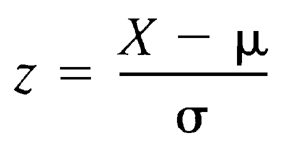

## Why do we need Z-scores

> "Z-scores in general allow us to compare things that are NOT in the same scale, as long as they are NORMALLY distributed." - CrashCourse

For example, although we know everyone's score, but by only watching those scores it's hard to know how good he is or how bad he is compare to anyone else in the dataset. etc., if most of the students score above 90, can we say someone scores 90 is good?

So `Z-score` gives a solution for this: compare the score to the "average".

`Z-score` is especially good to compare **different type of data**, etc., compare 100-score exam & 150-score exam, compare IELTS & TOFEL, compare apples & oranges, compare a baseball player & football player....

All in all, `Z-score` is a process of **`Normalization`**, which "normalize" different set of data to **same standard** and compare.

Compares the various grading methods in a normal distribution:

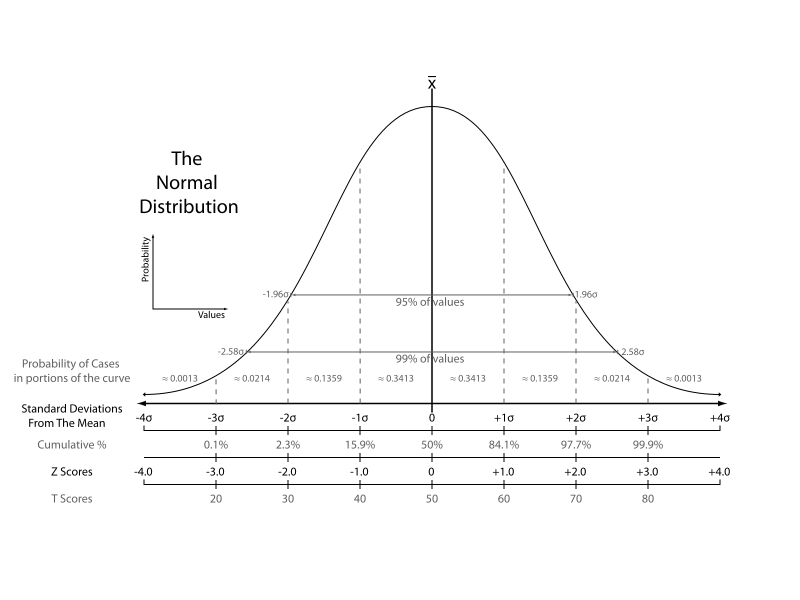

## How to understand the formula?

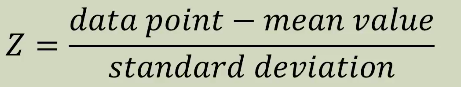

With comparing each one's score with the **mean**: `x - μ`, we will get a kind of `deviation`.

But at this point we still don't know whether each one's `deviation` is big or small.
We need a "standard" to compare each deviation.
Just like the `mean` is the **average** of all scores,
`standard deviation` is the **average** amount of deviation of all scores, which will tell us each deviation is large or not.
So we want to compare each `deviation` with the `Standard deviation`: `deviation ÷ 𝜎`

And we get the whole picture:
`Standard Score  = (𝓍 - μ) / 𝜎`

### How to understand the Number of Standard Deviations?

Assume the standard deviation is `𝜎`(sigma), so the number of it just means how much it is **scaled**.
etc., `2𝜎` means `a doubled standard deviation`, and `1.5𝜎` means `1.5 times larger SD`.
If your Z-score is `2𝜎`, it means your score is `doubled standard deviation away from the mean`.

### Example
There's some exam data of a class:

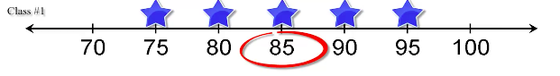

Here's their z-scores:

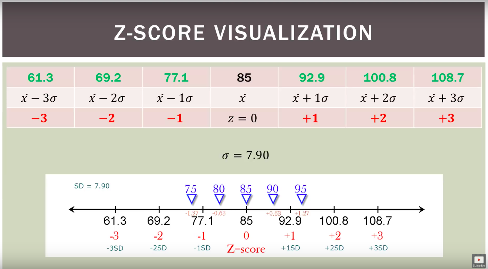

### Example
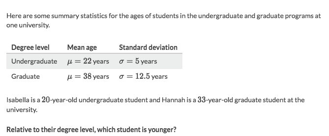
Solve:
- Isabella's z-score is: `(20-22)/5 = -0.4`
- Hannah's z-score is: `(33-38)/12.5 = -0.4`
- So they're equally young in their degree level.

## 「Z-table」 Convert Z-score to Percentile

> This ONLY applies to `Normal Distribution`

[Refer to Khan academy: Standard normal table for proportion below](https://www.khanacademy.org/math/ap-statistics/density-curves-normal-distribution-ap/modal/v/z-table-for-proportion-below)

If you know someone's `z-score`, you will easily get his `percentile` from the `Z-table`.
Vice versa, if you know his `percentile`, you can get his `z-score` as well.

How to use?
The `1st Row` represents the `tenth decimal` of the `z-score`,
the `1st Column` represents the `hundredth decimal` of the `z-score`.
According to the given `z-score`, and search over the rows & columns to get the corresponded **intersection**, which is the `percentile`.

etc.,
Someone's `z-sore` is "0.57", and you want to know what `percentile` he's at, or what proportion is below his score. 
Just go over to the `z-table`, first get to the row at `0.5`, and find the column of `0.7`, and the **intersection** will be his `percentile`, which is "0.7157" or "71.57%" in this case.

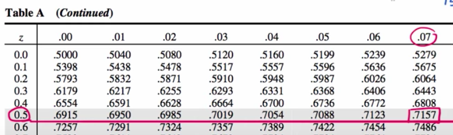

Common values:
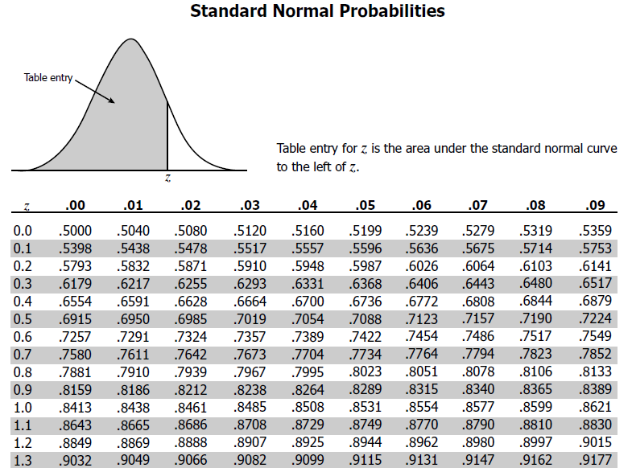

Explicit Z-table:

### Example
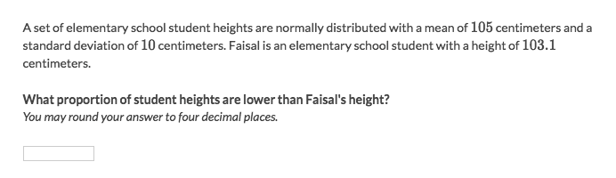

Solve:
- Get the `z-score` of student Faisal: `(103.1-105)/10 = -0.19`.
- Refer to the `Z-table` we'll get the corresponding `percentile rank`: 0.4247.
- The answer is 0.4247 (42.47%) of students are shorter than Faisal.

### Example
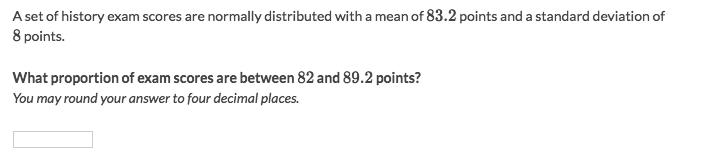

Solve:
- Get two z-scores: `(82-83.2)/8 = -0.15`, `(89.2-83.2)/8 = 0.75`
- Get both points' corresponding `percentiles`: 0.4404 & 0.7734
- Cut out the "overlays": `0.7734 - 0.4404 = 0.333`
- So the answer is 0.333 or 33.3%.

## 「Z-table」Convert Percentile to Z-score

[Refer to Khan academy: Finding z-score for a percentile](https://www.khanacademy.org/math/ap-statistics/density-curves-normal-distribution-ap/modal/v/finding-z-score-for-a-percentile)

Just do the other way around by looking for the given `percentile cell` and then read out the corresponded column & row, that will get you the z-score.

### Example
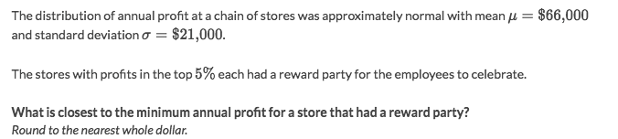

Solve:
- "Top 5%" means the `minimum percentile rank` is at 95, which is 0.95 in percentage.
- Find out the corresponding `z-score` according to the `percentile`:
    - There's no "0.95" in z-table but "0.9495" & "0.9505"
    - Since the "minimum percentile` is 0.95, so "0.9505" is the one
    - "0.9505" corresponds to the z-score "1.65"
- Take the z-score back to `z-score formula`: `1.65 = (x-66000)/21000`
- Get the `x=100650` which is the minimum annual profit.

