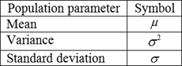
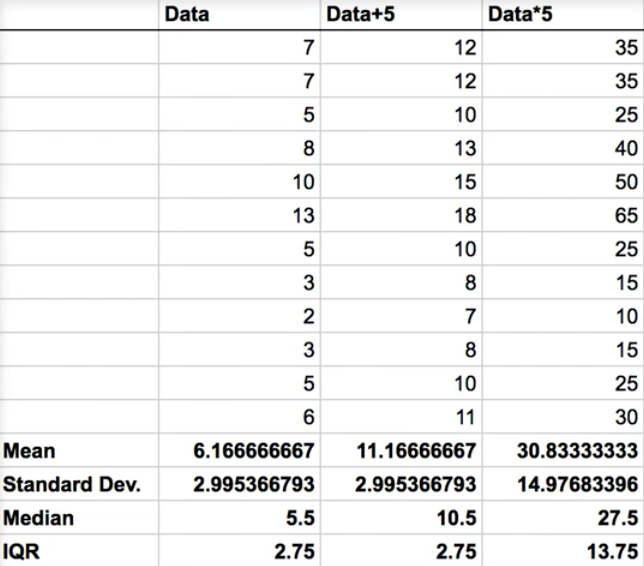
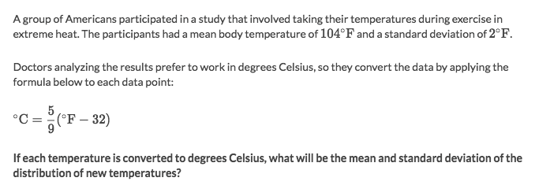

#  ❖ Population Parameters [DRAFT]

##  「Population」

In statistics, the `Population` is the collection of **all** people, items, or objects that are required for a specific study.

## 「Parameter」

> It's also called the `Population parameter`.

The word `parameter` in Statistics means different than in Mathematics.
It is the **number** that describes the population.
It is obtained from a statistic which is calculated from a randomly selected sample of the given population.

Common `population parameters`:

## 「parameter」 vs. 「statistic」

The word _parameter_ often refers to the `Population statistic`, etc., population mean, population SD.

The word _statistic_ although generally refers to a fact about the data, but it also often refers to the `Sample statistic`, etc., sample mean, sample proportion.

## 「Central Tendencies」

(To be written...)

## How parameters change as data is shifted and scaled
[Refer to Khan academy: How parameters change as data is shifted and scaled](https://www.khanacademy.org/math/ap-statistics/density-curves-normal-distribution-ap/modal/v/how-parameters-change-as-data-is-shifted-and-scaled)

We see that:
- Adding a number to each value: The Central tendencies (Mean/Median) will **INCREASE** the same amount with each value. And Spread (Standard deviation/IQR) will **NOT** change.
- Multiply a number to each value: Both Central tendencies and Spread will **scale up** the same amount of each value.

### Example

Solve:
- The mean will be affected by both **shifting** and **scaling**, so the new mean is `5/9 * (104-32) = 40`
- The standard deviation will only be affected by **scaling**, so it will then be: `5/9 * 2 = 1.11`
