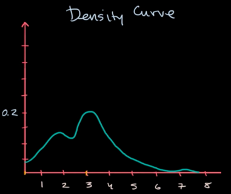
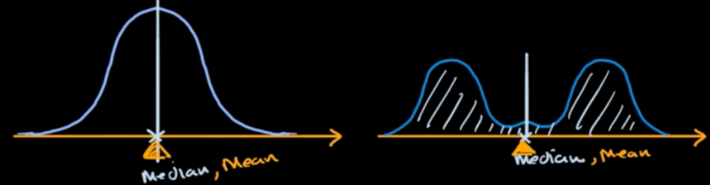
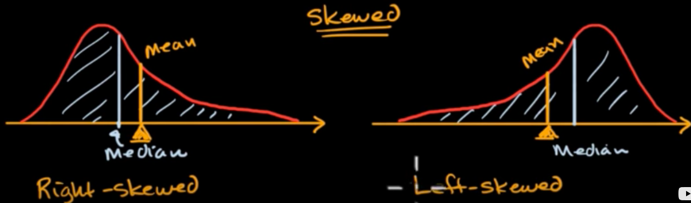
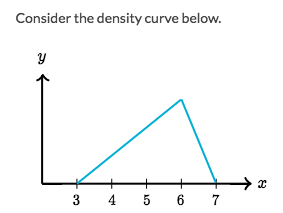
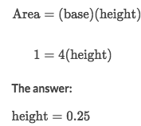
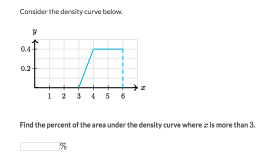
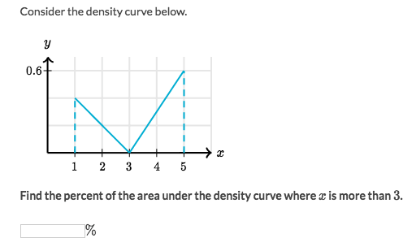

# Density Curves

Some times `histograms` aren't good enough to visualize large amount of dataset. And `Density Curve` plot will solve the problem, as it can take on **any** value in a **continuum**, they're not just thrown into some buckets.

Axes (Tricky):
- `X-axis` represents the values of data points
- `Y-axis` represents the **proportion** of certain **interval**, which is up to 1 (or 100%).

## Area

The entire **AREA** under the curve is **100%**, which represent all the data points.

The **percentage** of a interval of data points, is the **AREA** under the curve over the interval. NOT the height of a point.

## Parameters of Density Curves

### Median
For **Symmetric distribution**, the **Median** is right at the middle, which is at 50th percentile.

For **Skewed distribution**, the **[Left side area] = [Right side area] = 50%**.

### Mean
For **Symmetric distribution**, the **Mean** is right at the middle:

For **Skewed distribution**, the **Mean** is at the right or left of the **Median**:

### Example

What is the height of median?

Solve:
- The median is at 50th percentile, which both left & right area are **50%**.
- But we **CAN'T** know exactly where the median is.
- By eyeballing it, the point divide the shape to TWO EQUAL areas is around 5.5,
- But without further information we can't tell the height.

### Example

Solve:
- The **whole area** under the curve is `100%`
- The base is 4, so:

### Example

Solve:
- The area under the density curve when x>3 is the **whole area**
- Hence the area is 100%

### Example

Solve:
- Area over interval `[3,5]` is a triangle.
- Apply the area formula: `1/2 * (5-3)*0.6 = 0.6 = 60%`
