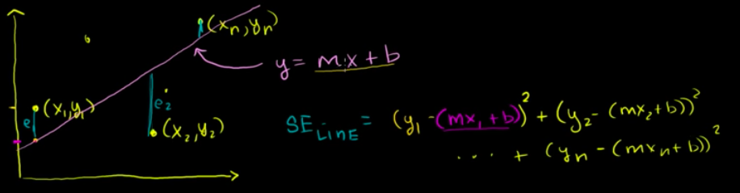
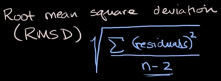

#  ❖ 「R²」 Coefficient of Determinator

> `R-squared` means **Squared Residuals**, which is the `SE` (Standard Error).

**R squared is ALWAYS between 0 and 1, and the higher your R squared, the better.**

[Refer to Khan academy: R-squared or coefficient of determination](https://www.khanacademy.org/math/ap-statistics/bivariate-data-ap/modal/v/r-squared-or-coefficient-of-determination)

R squared is the variation of y that is explained by your linear model.
```
R-squared = Explained variation / Total variation
```

## Formula


(SE_line is `Standard Error from line`)

- If `SE` (Standard Error) from the line is **small**   ->   r² close to 1   ->  The line is a **good fit**.
- If `SE` (Standard Error) from the line is **large**   ->   r² close to 0   ->    The line is **not** a good fit

## Understanding 「R-squared」

[Refer to youtube: 3.2: Linear Regression with Ordinary Least Squares Part 1 - Intelligence and Learning](https://www.youtube.com/watch?v=szXbuO3bVRk)



### Why do we square "Residuals"?

It's just a way to keep those `residuals` (difference from the regression line) **positive**.
And actually the `residuals` or `squared residuals` DOESN'T really matter to us, 
because we're to **MINIMIZE** them anyway. Take the minimum residual or minimum residual squared doesn't matter.


### Why do we square 「Correlation Coefficient」?

(To do...)

### Why do we add them together

By adding them we will get the **TOTAL ERRORS**, which is the one we're going to **minimize**.


## 「Root Mean Square Error」RMSE

> It's also called the `Root Mean Square Deviation` (RMSD), or `Standard Deviation of the Residuals`.

This method is to measure the how good the `Regression Line` fits the data.

[Refer to Khan academy: Standard deviation of residuals or root mean square deviation (RMSD)](https://www.khanacademy.org/math/ap-statistics/bivariate-data-ap/modal/v/standard-dev-residuals)



