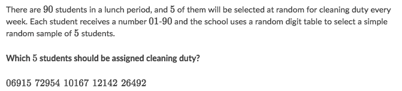
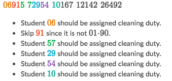
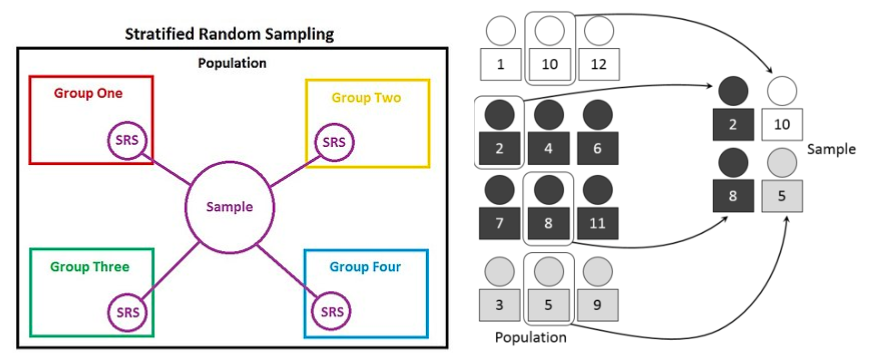
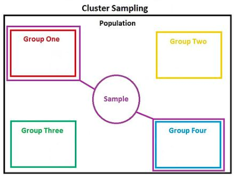
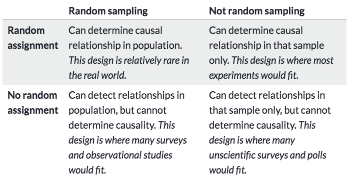

#  ❖ Random Sampling

> "Humans are famously bad at truly random." - Sal Khan

[Refer to Khan academy: Techniques for generating a simple random sample](https://www.khanacademy.org/math/ap-statistics/gathering-data-ap/modal/v/techniques-for-generating-a-simple-random-sample)
[Refer to Khan academy: Techniques for random sampling and avoiding bias](https://www.khanacademy.org/math/ap-statistics/gathering-data-ap/modal/v/techniques-for-random-sampling-and-avoiding-bias)

Methods of Random sampling:
- **Simple** Sampling
- **Stratified** Sampling
- **Clustered** Sampling

## 「Simple Sampling」

[Refer to Khan academy: Techniques for generating a simple random sample](https://www.khanacademy.org/math/ap-statistics/gathering-data-ap/sampling-methods/v/techniques-for-generating-a-simple-random-sample)
[Refer to Wiki: Simple random sample](https://www.wikiwand.com/en/Simple_random_sample)

- Set every one a number, and randomly pick numbers out of the bowl, **dump** the invalid numbers.

### Example

Solve:

## 「Stratified Sampling」

Divide the population to couple of groups, and take samples from **EACH** group.

[Refer to Wiki: Stratified sampling](https://www.wikiwand.com/en/Stratified_sampling)

## 「Clustered Sampling」

Divide the population to couple of groups, and randomly take **a few** GROUPS from them as samples.

[Refer to Wiki: Cluster sampling](https://www.wikiwand.com/en/Cluster_sampling)

## 「Random Sampling」 vs. 「Random Assignment」

[Refer to Khan academy: Random sampling vs. random assignment (scope of inference)](https://www.khanacademy.org/math/ap-statistics/gathering-data-ap/modal/a/scope-of-inference-random-sampling-assignment)

## 「Simple Random Sample」SRS

It means that the sample was selected in such a way where each member and set of members has an equal chance of being in the sample.
