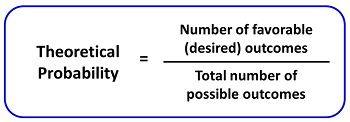

#  ❖ Probability [DRAFT]

## 「Theoretical Probability」 vs. 「Experimental Probability」

> The `experimental probability` should get **closer and closer** to the `theoretical probability` after trying more and more times.

- `Theoretical Probability`: It's what's expected to happen based on the possible outcomes, assuming equally likely events.
- `Experimental Probability`: It's the result of an experiment or simulation after a large number of times.

