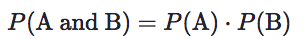
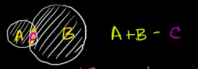
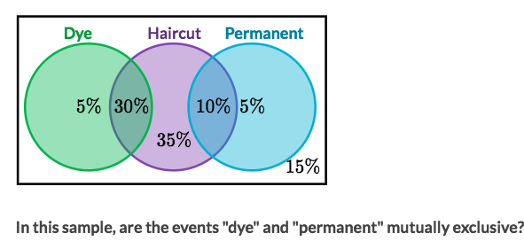
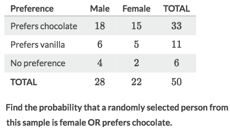
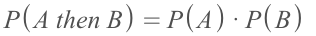
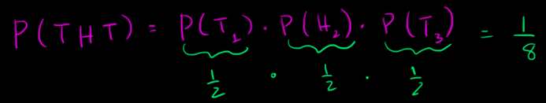
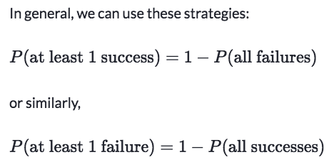

#  ❖ Probability Rules

## 「Multiplication Rule」 A and B

The probability of multiple events occur at the same time is the multiplication of their probabilities. 

## 「Addition Rule」A or B

The `A or B` probability is both of their favourable outcomes **minus** the **OVERLAPS** (common outcomes), which is `(A + B - C)`.
The formula is:
`P(A or B) = P(A) + P(B) - P(A and B)`.

[Refer to Khan academy: Addition rule for probability](https://www.khanacademy.org/math/ap-statistics/probability-ap/modal/v/addition-rule-for-probability)

### Example

Solve:

### 「Mutually Exclusive events」

Mutually exclusive events cannot happen at the same time.

#### Example

#### Example

Solve:
- Females=22, Chocolate=33, Overlaps=15
- The probability is: `(22+33-15)/50`

## 「Compound probability」A then B

> The problem "What's the probability of flipping coin to get 3 head in a row?" is a typical `Compound probability of independent events` problem.

The formula of `Compound probability of independent events` is the same with **multiplication rule**.

Example: Flipping a coin three times, what's the probability of getting a tail, head and tail ? 

## 「At least one」 probability

