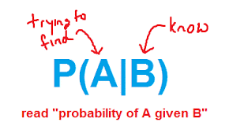
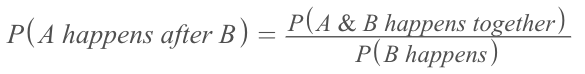
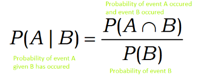
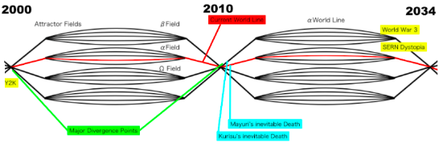
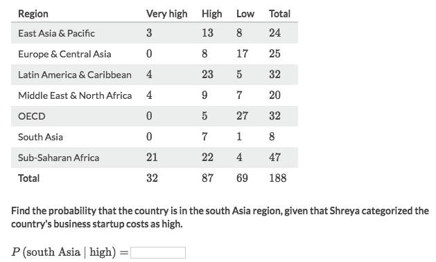

#  ❖ Conditional Probability

It's NOT just both events happened, it's asking the probability of one event **AFTER** another event happened.
It's based on a **happened** event, that's why you're to divide the probability of the happened event.

## Notation

`Probability of B given A` (B **after** A, or B in condition of A),
or `Probability of A given B`:

## Formula

## Understanding 「Conditional Probability」

[Refer to youtube: Probability Part 2: Updating Your Beliefs with Bayes: Crash Course Statistics #14](https://www.youtube.com/watch?v=oZCskBpHWyk)

> Based on the concept of Set. 
It’s lot more intuitive to understand with a vann diagram.
P(A | B) = P(A & B) / P(B)
Circle of B is there for sure, proportion of A happen must be IN the circle of B, which is P(a & b). 
Divided by P(B) means, the proportion of A of B, means how much percentage of A space taken on B. 

### 「The Parallel World」

Imagine there are many "parallel worlds", say A-world & B-world which are the worlds A & B occur.
Of course they're parallel and happening at the same time, yet there could be chance of intersection, that A occurs in B's world, or B occurs in A's world.

And the chance of one event occurs in "another world" is the `Conditional probability`.

> In the context of the Anime _Steins;Gate_, the conditional probability is chance of Mayuri being killed in Alpha-worldline.

_Steins;Gate Worldline_:

### 「A GIVEN B」
It means "A after B", or "A after B has happened".
Instead of happening at the same time `P(A and B)`, the probability **won't be the same** if one has already happened.

### Divide by B's probability

It shows how much the `A and B` covered the happened event `B`.

### Example

Solve:
- Based on the `conditional probability` formula: `P(A|B) = P(A and B) / P(B)`
- The `P(south Asia ∣ high) = P(south Asia and High) / P(high) = 7/188 ÷ 87/188 = 7/87`
