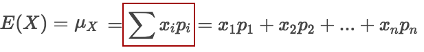
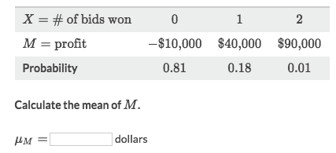
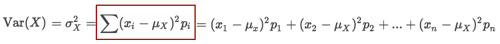
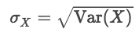
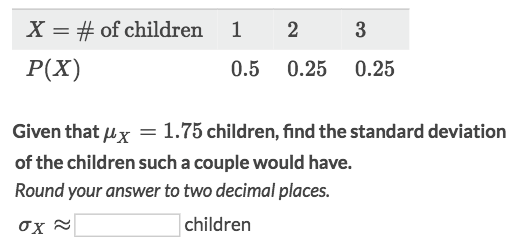

# Discrete Random Variable [DRAFT]

## Mean (Expected Value)
In the case of a discrete random variable, expected value or mean — denoted as `E(X)` or `μx` is the long-run average outcome. To find expected value, take each value, multiply it by its respective probability, and add up all the products.

(Where the sum of all possible value of `x`)

### Example

Solve:
- Note that it's asking for mean of **M**, not for **X**.
- Apply the formula of Expected Value of Discrete Random Variable
- `μx = (-10*0.81) + (40*0.18( + (90*0.01) = 0`

## Variance (Deviation)

**Variance (σ²):**

**Standard Deviation (σ):**

### Example

Solve:
- Apply the formula for variance.
- `σ² = (1-1.75)^2*0.5 + (2-1.75)^2*0.25 + (3-1.75)^2*0.25 = 0.6889`
- `σ = √0.689 = 0.83`
