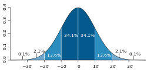
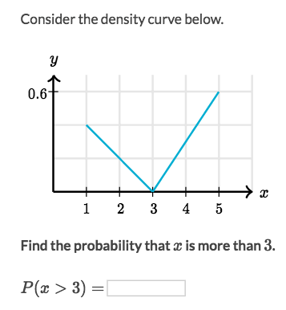
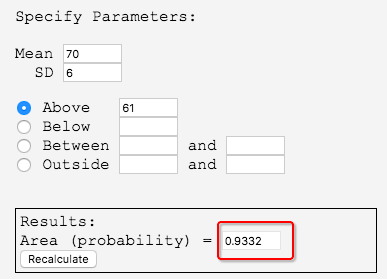
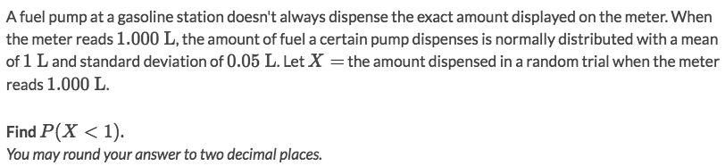
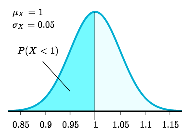

#  ❖ Probabilities from 「Density Curves」

- `Discrete distribution`: it can only take finite because numbers.
- `Continuous distribution`: it can take an infinite number.

That’s why `Discrete Distribution` use **histogram**,
and `Continuous Distribution` use **density curve**.

## Probabilities over an 「Interval」

### Example

Solve:
- Notice that the probability of `x>3` is the **area** of the triangle between 3 and 5.
- So `P(x>3) = Area(3 to 5) = 1/2 * (5-3) * 0.6 = 0.6`

## Probability in 「Normal Distribution」

### How to use Calculator for Probability in normal distribution
We could use any `Graphic Calculator` or online calculator, and input the `Mean`, `Standard Deviation`, `Lower bound`, and `Upper bound`.

[`▶︎ Online Normal Distribution Calculator`.](http://onlinestatbook.com/2/calculators/normal_dist.html)

etc., we know the `mean = 70`, `SD=6`, and asked to calculate the probability of value greater than 61.
By input these values we'll get the anser:

### Example

Solve:
- We know the Probability Distribution is a **Normal Distribution**.
- For the probability of `X<1`, we're to get the **area** of `X<1`.

- So the the `Z-score` at `X=1` is necessary for calculation. 
- `Z-score = (X-μ)/σ = (1 - 1)/0.05 = 0`
- Take a look at `Z-score table`, we know that the probability of `0` is 0.5.

