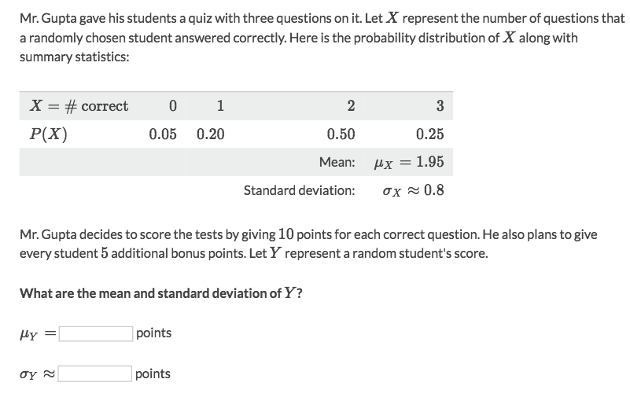
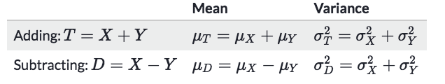
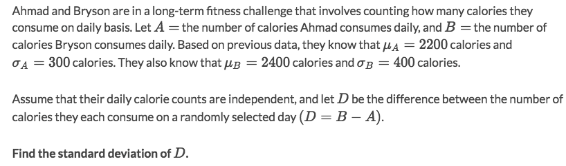
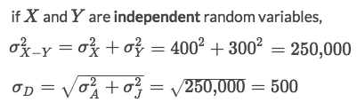
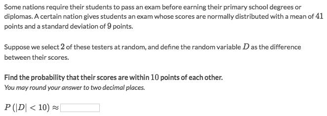
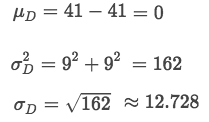
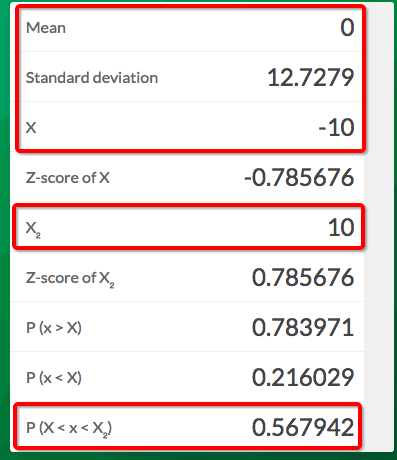

#  ❖ Operations of 「Random Variables」

> Some basic "algebraic" operations, like adding/multiplying a number, or combining different R.V.s

## 「Shift」
The **addition** or **subtraction** of `Random Variable X` will have these effects:
- Mean: Shift by the same value with X.
- Variance: Maintain the same.

## 「Scale」
The scale of `Random Variable X` will have these effects:
- Mean: Scale by the same value with X.
- Variance: Scale by the same value with X.

### Example

Solve:
- Effect on mean(μ): `μY = 10(μX) + 5 = 24.5`, because mean will be effected by both **shift** & **scale**.
- Effect on Standard deviation(σ): `σY = 10μX = 8`, because σ will only be effected by **scale**.

## 「Combine」 Random Variables

[Refer to wiki: Algebra of random variables](https://www.wikiwand.com/en/Algebra_of_random_variables)
[Refer to article on Khan academy: Combining random variables](https://www.khanacademy.org/math/ap-statistics/random-variables-ap/modal/a/combining-random-variables-article)

Important facts about combining variances:
- The variables must be independent to each other.
- We can find the `standard deviation` by taking square root √ of the combined variances.
- The variance **increases** even when we subtract random variables.
- If both Random Variables are **normally distributed**, then the `Difference of them` will also be **normally distributed**.

### Example

Solve:

## Probability of 「Combined Normal Random Variables」

Remember:
**If both Random Variables are normally distributed, then the Difference of them will also be normally distributed.**

### Example

Solve:
- Let `D` be the new Random Variable which `D = X - Y`
- For calculating the probability of a normal distributed random variable, we need to know the mean, standard deviation, and boundaries.
- Get the basic stats of D:

- According to the condition, the boundary is `-10 < D < 10`
- Input the required information to a calculator:

- The answer is `0.57`.
