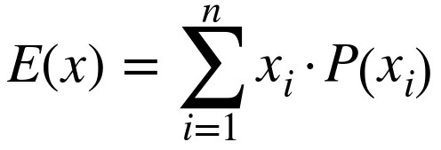
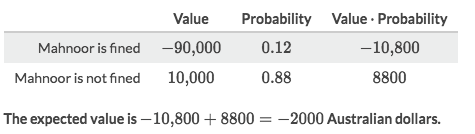
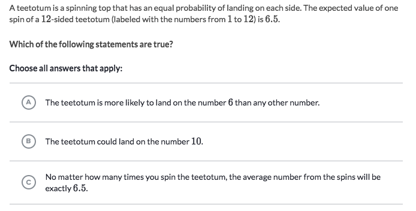

#  ❖ 「Expected Value」 of a Random Variable

> It's also known as the `Expectation`, `Mathematical Expectation`, `EV`, `Average`, `Mean Value`, `Mean`, or `First Moment`.

[Refer to wiki: Expected value](https://www.wikiwand.com/en/Expected_value)

"In probability theory, the expected value of a random variable, intuitively, is the long-run average value of repetitions of the experiment it represents."

## Calculate 「Expected Value」

### Example

Solve:
- `-1.4 -0.3 +1.2 +2.1 = 1.6`

### Example

Solve:

### Example

Solve:

