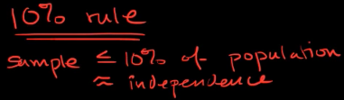

#  ❖ Binomial Random Variables

> `Binomial Distribution` is one of the `Discrete Distributions`.

`Binomial` means "Two terms", that being said the `Binomial Random Variable` is a `Random Variable` contains **TWO Parameters**:
- `n`: A certain number of trails, which is a certain number.
- `p`: A certain & constant probability of each trail being success.

[Refer to wiki: Binomial distribution](https://www.wikiwand.com/en/Binomial_distribution)
[Refer to article: Binomial Random Variables](http://bolt.mph.ufl.edu/6050-6052/unit-3b/binomial-random-variables/)
[Refer to Khan academy: Binomial variables](https://www.khanacademy.org/math/ap-statistics/random-variables-ap/modal/v/binomial-variables)

## Requirements

The **requirements** for a random experiment to be a binomial experiment are:
- `n`: There is a **certain** total number of trails.
- `p`: A **certain & constant** probability for each trail.
- `Yes-no question`: Each trail's outcome is **either** success or failure.
- `Independent`: Each trail is independent to each other.

It can be simplified as: **N, P, YES-NO, INDEPENDENT**

## Identifying 「Binomial Variables」

### Examples of binomials

- A fair coin is flipped 20 times; X represents the number of heads.
**X is binomial with n = 20 and p = 0.5.**
- You roll a fair die 50 times; X is the number of times you get a six.
**X is binomial with n = 50 and p = 1/6.**
- The probability of having blood type B is 0.1. Choose 4 people at random; X is the number with blood type B.
**X is binomial with n = 4 and p = 0.1.**
- Draw 3 cards at random, one after the other, with replacement, from a set of 4 cards consisting of one club, one diamond, one heart, and one spade; X is the number of diamonds selected. Sampling with replacement ensures independence.
**X is binomial with n = 3 and p = 1/4**
- Approximately 1 in every 20 children has a certain disease. Let X be the number of children with the disease out of a random sample of 100 children. Although the children are sampled without replacement, it is assumed that we are sampling from such a vast population that the selections are virtually independent.
**X is binomial with n = 100 and p = 1/20 = 0.05.**

### Examples of non-binomials
- Roll a fair die repeatedly; X is the number of rolls it takes to get a six.
**X is not binomial, because the number of trials is not fixed.**
- A student answers 10 quiz questions completely at random; the first five are true/false, the second five are multiple choice, with four options each. X represents the number of correct answers.
**X is not binomial, because p changes from 1/2 to 1/4.**
- Draw 3 cards at random, one after the other, without replacement, from a set of 4 cards consisting of one club, one diamond, one heart, and one spade; X is the number of diamonds selected.
**X is not binomial, because the selections are not independent. (The probability (p) of success is not constant, because it is affected by previous selections.)**

## 「Independence Assumption」 10% Rule

To identify a binomial random variable, we also need to **prove its independence**.
In the case of large number of trails, we can't examine each trail but only to sample out a smaller number of trails.

With **Replacement Sampling**, since it's NOT really independent because when you take out a sample it will affect the rest samples. But the good thing is if the base number is large enough, then your replacement won't be a big deal to affect the result.

So that's the reason we introduced the `10% Rule`, which means if the number of your samples are less than 10% of total, then we can assume each trail is **independent**. Because the portion is too small to affect all.

### 「Simple Random Sample」SRS

It means that the sample was selected in such a way where each member and set of members has an equal chance of being in the sample.

### Replacement & Non-replacement
Sampling with replacement, means that every time you take out the sample, the total number will decrease, which affects the probability of rest samples. etc., there're 10 balls with different color, if you take out a red ball, then the probability of getting another red ball in the rest 9 balls will decrease.

Sampling with Non-replacement, means that each time you take out the sample, you put it back.

### 「10% Rule」

`10% Rule` is a rule to **assume independence** between trails.

If the number of your samples are less than 10% of total, then we can assume each trail is **independent**. Because the portion is too small to affect all.

