# Binomial Probability

[Refer to article on Khan academy: Binomial probability (basic)](https://www.khanacademy.org/math/ap-statistics/random-variables-ap/modal/a/binomial-probability-basic)
[Refer to Khan academy: Generalizing k scores in n attempts](https://www.khanacademy.org/math/ap-statistics/random-variables-ap/modal/v/generalizing-k-scores-in-n-attempts)

[`▶︎ Online Binomial Probability Calculator`](https://www.omnicalculator.com/statistics/binomial-distribution)

## Formula of 「Binomial Probability」


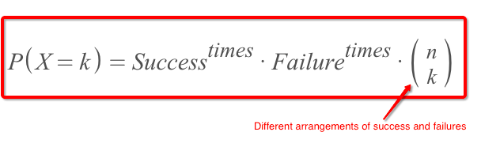


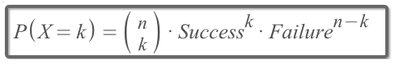


We could simplify (verbal) it as:
```
P(X=r) = Combinations × P(yes) × P(no)
```

For the **combinations**, here's the formula:
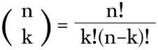

Or use the [`▶︎ Online Combination Calculator`](https://www.omnicalculator.com/statistics/combination).


Example:
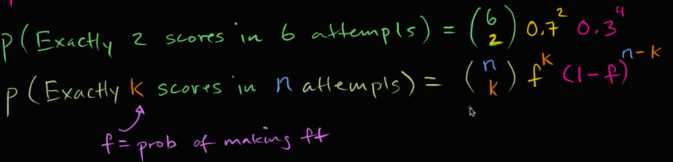

### Example

Solve:
- Apply the `Binomial Probability Formula`, the answer is:
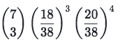


## 「Mean & Variance」 of Binomial R.V.

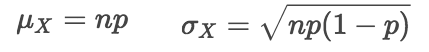

- `Expected Value = Mean = μx`
- `Variance = Standard Deviation = σx`


### Example
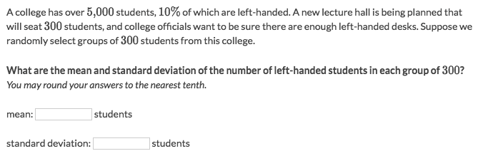
Solve:
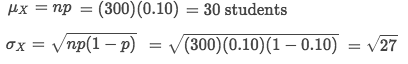


### Example
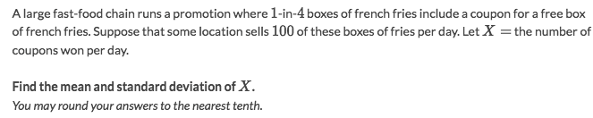
Solve:
- `Mean = μx = np = 100 * 0.25 = 25`
- `SD = σx = √(np(1-p)) = √(25*0.75) = 4.33`


## 「Cumulative Binomial Probability」


### Example
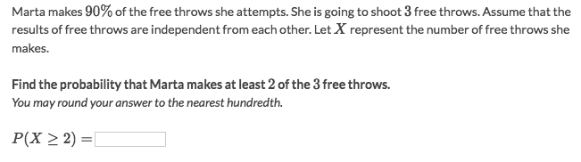
Solve:
- One way:
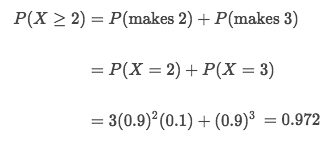
- Another way:
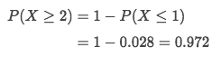


### Example
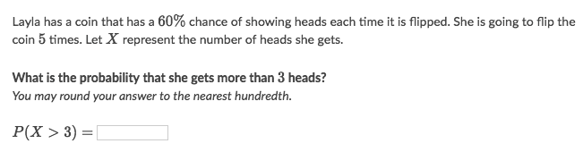
Solve:
- We can see it as `P(X > 3) = P(4) + P(5)`, or `P(X>3) = 1 - (P(1) + P(2) + P(3))`, we're gonna use first one in this case.
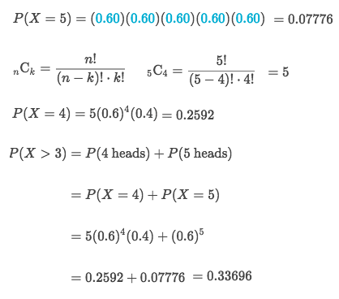

