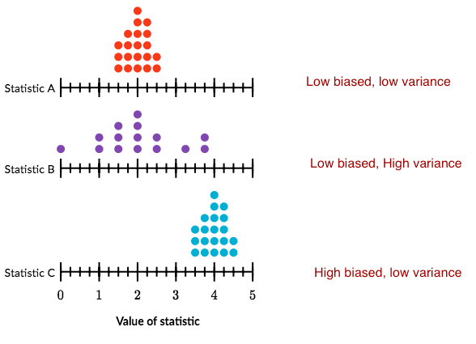
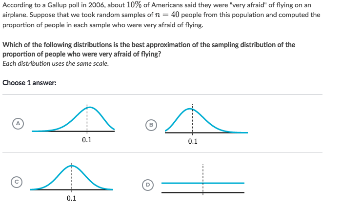

#  ❖ Sampling Distribution

It's just taking out the **parameters**(Mean/SD..) from different samples of the SAME population, and make them as a distribution. etc., _Distribution of means_,  _Distribution of standard deviations_...

[Refer to Khan academy: Introduction to sampling distributions](https://www.khanacademy.org/math/ap-statistics/sampling-distribution-ap/modal/v/introduction-to-sampling-distributions)

## 「Bias」 of Sample Statistic

[Refer to Khan academy: Sample statistic bias worked example](https://www.khanacademy.org/math/ap-statistics/sampling-distribution-ap/modal/v/sample-statistic-bias-worked-example)

- **Unbiased** Sample Estimation: The distribution is roughly **symmetric** at the real parameter of population.
- **Biased** Sample Estimation: The sample distribution is **NOT symmetric** at the real parameter of population.

Example:
The dotplots below show an approximation to the sampling distribution for three different estimators of the same population parameter, and the **actual value** of the population parameter is 2.

## 「Shape」 of Sample Distribution

Usually the Sample Distribution is **Normally distributed**, only on these conditions:
- The Population is Normally distributed, or
- There're at least **10 expected success** in the sample, and
- There're at least **10 expected failures** in the sample.

It means that:
- `np ≥ 10`, and
- `n(1-p) ≥ 10`.

But under some **extreme conditions** it can also be **skewed**:
**The expected success items are less than 10 in the sample.**

### Example

Solve:

