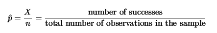
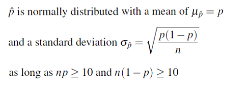
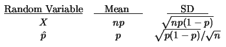
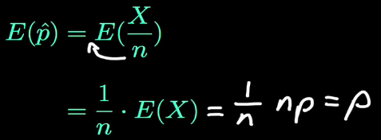
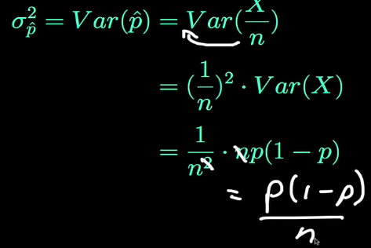
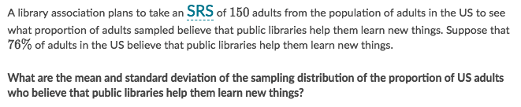
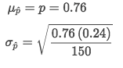
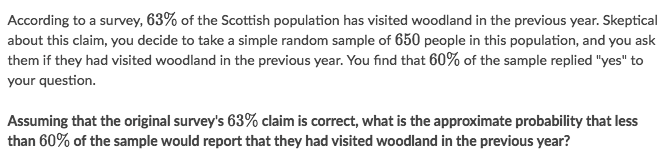

#  ❖ Sample Proportion

> The full name is `Sampling Distribution of the Sample Proportion`, which's denoted by `p-hat`.

[Refer to youtube: The Sampling Distribution of the Sample Proportion](https://www.youtube.com/watch?v=fuGwbG9_W1c)
[Refer to article: The Sample Proportion](http://www.stat.wmich.edu/s216/book/node68.html)
[Refer to article: Sampling Distribution of the Sample Proportion, p-hat](http://bolt.mph.ufl.edu/6050-6052/module-9/sampling-distribution-of-p-hat/)

`Sample Proportion` is the **proportion of success** in a sample.

> Sample Proportion(p-hat) is a random variable, 
specifically a **`Binomial Random Variable`**. 

So let **X** denotes the _number of success_ in the sample, which is the **Binomial Random Variable** with parameter _n_ and _p_,

## 「Mean & Variance」 of Sample Proportions

Recall that the _binomial random variable X_:
- has a mean of **np**
- has a variance of **np(1-p)**
- is approximately **normally distributed** for LARGE Sample Sizes (Central Limit Theorem).

Hence, we derived the _Mean & Variance_ of Sample Proportion `p-hat` from X:

Why is that?

That's why we say:
`p-hat` is an **unbiased estimator** for `p` of population.

And for Standard Deviation of Sample Proportion:

### Example

Solve:

## 「Probabilities」 with Sample Proportions

It's just to find out the probability area in the Normal Distribution.
All you need is the Mean, Standard Deviation and the point you're to measure.

### Example

Solve:
- Calculate the mean of sample proportion is `0.63`
- Calculate the standard deviation of sample proportion is `0.019`
- Use an online Normal Distribution calculator, set up the upper boundary as `0.60`
- Get the probability area is about `0.06`

