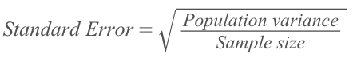
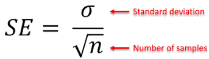

#  ❖ Standard Error (SE) [DRAFT]

> `Standard Error` is actually a short version of saying the `Standard Deviation of the Sampling Distribution`.

[Refer to wiki: Standard error](https://www.wikiwand.com/en/Standard_error)

### Why is it an 「Error」?

Assume the _Population mean_ is 0, then the `Standard Error` is the error/distance of the _Sample Mean_ away from the _True population mean_.

### What if we don't know the 「Population variance」?

### 「Standard Error of Sample Mean」SEM

If we're to find the `Standard Deviation of the Mean of a Sampling Distribution`, we call it as the `Standard Error of the Mean` (SEM).

[Refer to Khan academy: Standard error of the Mean](https://www.khanacademy.org/math/statistics-probability/sampling-distributions-library/modal/v/standard-error-of-the-mean)

_Standard Error_ gives us **how far the Sample Mean will deviate from the true mean**.

### 「Standard Error of Sample Proportion」

