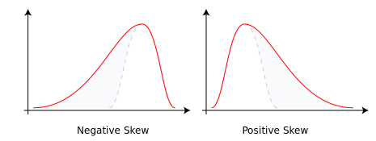
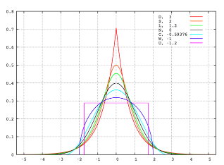
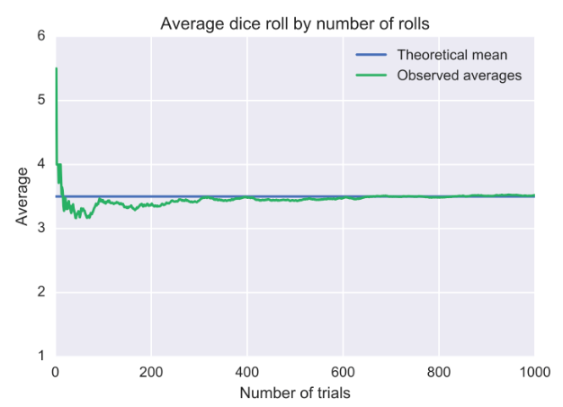

#  ❖ 「Central Limit Theorem」 and 「Law of Large Numbers」 [DRAFT]

[Refer to article: Central Limit Theorem and Law of Large Numbers](http://mathcentral.uregina.ca/QQ/database/QQ.09.99/yam1.html)

The Central Limit Theorem is about the **SHAPE** of the distribution.
The Law of Large Numbers tells us where the **CENTRE** (maximum point) of the bell is located. 

## 「Central Limit Theorem」

> One of the most fundamental & profound concepts in Statistics or even Mathematics.

[Refer to youtube: Introduction to the Central Limit Theorem](https://www.youtube.com/watch?v=Pujol1yC1_A)
[Refer to Khan academy: Central limit theorem](https://www.khanacademy.org/math/statistics-probability/sampling-distributions-library/modal/v/central-limit-theorem)

The theorem is about the `Sample Mean`, saying:

**The distribution of Sample Mean tends towards the Normal Distribution as the Sample Size increases, regardless of the shape of Population Distribution.**

> **As a _very rough guidline_, the Sample Mean is approximately Normally distributed if the Sample Size is at least 30.**

That being said:
- If the `Sample Size < 30`, the shape of Sample Mean Distribution will be matching the shape of Population Distribution.
- If the `Sample Size ≥ 30`, the shape of Sample Mean Distribution will be **Normally distributed**, **regardless** what the shape of Population Distribution is.

### How 「Normal」 is the distribution

[Refer to Khan academy: Sampling distribution of the sample mean](https://www.khanacademy.org/math/statistics-probability/sampling-distributions-library/modal/v/sampling-distribution-of-the-sample-mean)

### 「Skewness」

### 「Kurtosis」 Tailedness

### 『Standard Deviation』
The SD tends to be smaller and smaller as the Sample Size increases or the more times you take samples.

## 「Law of Large Numbers」 (LLN)

[Refer to Khan academy: Law of large numbers](https://www.khanacademy.org/math/statistics-probability/random-variables-stats-library/modal/v/law-of-large-numbers)
[Refer to wiki: Law of large numbers](https://www.wikiwand.com/en/Law_of_large_numbers)

It is saying:
The average of the results obtained from a large number of trials should be close to the expected value, and will tend to become closer as more trials are performed.

### Strong 「Law of large numbers」

### Weak 「Law of large numbers」

