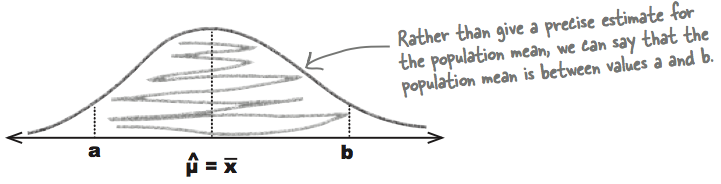
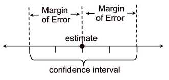
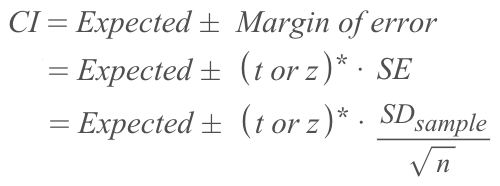
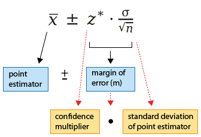
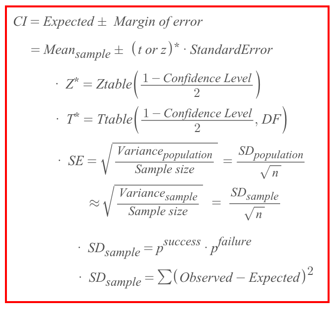
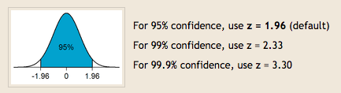

#  ❖ Confidence Interval (CI)

> Since there will always be _sampling error_ for estimating the true population, 
so it's a good practice to have a **confidence interval** while doing estimation on samples.

[Refer to youtube: Understanding Confidence Intervals: Statistics Help](https://www.youtube.com/watch?v=tFWsuO9f74o)
[Refer to article: Confidence Level & Margin of Error](http://www.geoib.com/confidence-level--margin-of-error.html)

A _Confidence Interval_ is a **"Tolerance Interval"**,
which statistically is an **estimated RANGE of values** that seem reasonable, which controls how **accurate** the estimation to be.

> We've learnt how to estimate an **exact** value for Population parameters. But the estimation can't be too good if it's exact. Hence _confidence interval_ gives a more reliable way to describe/guess the population.

## 「Inference」 & 「Inferential Statistics」

Inference means the **conclusions** we got from the _sample_ to describe the _population_ .

`Inferential Statistics` or `Statistic inference` means how we can go from describing data we already have to make **inferences** about data we don't have.

## 「Confidence Level」 Tolerance Level

_Confidence Level_ is a **decision** we made, that how much precise we want the guessing to be.
95% is the confidence level people often use.

Width of Confidence Interval:
The _width of confidence interval_ will be affected by two things:
- Variation
- Sample Size

## 「Point Estimator」 Expected Value

> You can literally call it the **Best estimator**, which is the best estimate of a population parameter.

A _point estimate_ of a population parameter is a single value used to estimate the population parameter. For example, the sample mean _x_ is a point estimate of the population mean _μ_.

> _Point Estimate_ uses sample data to calculate a single value which is to serve as a **"best guess"** or "best estimate" of an unknown **population parameter** (for example, the _population mean_). More formally, it is the application of a `point estimator` to the data to obtain a point estimate.

_Point Estimate_ is often set to be the _Sample Mean_, as the **Centre** of _Confidence Interval_.

### Why set the 「Point Estimator」 as 「Centre」?

Because the _Point Estimate_ (Expected value) is our **Best guess**, and every value differs with that would be seen as an **error**.
By stocking up all the errors around the "best guess" within our "Tolerance level" (Confidence level), we get a _Confidence Interval_.

## 「Sampling Error」

> It's also called "Variation due to sampling". 

Since the sample will NEVER BE PERFECT to represent the true population, so there will always be _Sampling error_.

- The **less** error allowed, the **less** confidence we are.
- The **greater** error allowed, the **more** confidence we are.

## 「Margin of Error」

> You can literally call it `Limit of confidence` or `Confidence Limit`.

We made up a decision of _confidence level_ we want it to be, 
and we set the **Sample Mean** as the CENTRE of the range, which slice the interval to half:

The confidence limits (min/max) is given by this formula, 
which uses the `Margin of Error`:

x = mean of the sample
z = z-score representing the size of the confidence interval you have set, measured in units of standard deviations from the mean
s = standard deviation of the sample
n = number of entries in the sample

## Formula for both 「Z-interval」 & 「T-interval」

### What 「z-score」 should you use?

Confidence | Z
-- | --
80% | 1.282
85% | 1.440
90% | 1.645
95% | 1.960
99% | 2.576
99.5% | 2.807
99.9% | 3.291

