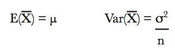
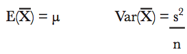
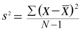
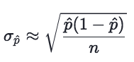
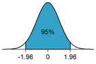

# ~Calculating Confidence Interval~ [DEPRECATED]

> Calculating the _Confidence Interval_ basically is just to convert a _confidence level_ , say 95%,  to a real value range, etc., (13kg, 28kg).

[Refer to _Head First Statistics_: Chapter.12](https://github.com/solomonxie/solomonxie.github.io/issues/50#issuecomment-418623355)

There're a few ways to calculate:
- Traditional Normal-based
- Informal
- Bootstrapping

We use the traditional Normal-based method more often.

Assume we've decided which _population statistic_ we'll be estimating, 
and which _level of confidence_ we need it to be,
then there're 2 steps to calculate the _Confidence Interval_:
1. Find the Sampling Distribution
2. Find the Confidence Limits

### Finding the Sampling Distribution
We know for constructing a Sampling Distribution we need the **Mean & Variance**:

Since the _population variance_ `𝜎²` is **UNKNOWN** to us,
so we are to **estimate** the _population variance_ by the sample's "_best estimator_" (point estimator), which is _Sample Variance_ s² in this case.

_s²_ is the _Sample Variance_, there're two types of formula:
here is the common formula:

here is the formula for sample proportion:

We assume the Sampling Distribution is **normally distributed**.

### Finding the Confidence Limits

Now we 

### Inverse Cumulative Normal Probability
Invert the given _cumulative normal probability_ (Confidence Level) back to z-score.

We've learnt how to convert a _percentile_ to z-score, and how about the `Cumulative Normal Probability`?

It's easy, in the graph we see that the _Confidence Level_ is the **middle part**.
if we cut the middle off, we'll get **two tails**, and either one can tell us the **percentile** position.

