#  ❖ 「Z-Interval」 Z statistics

_Z interval_ is the _Confidence Interval_ constructed using `Z-score`.

[`▶︎ Jump back to previous note on: Z-score`](https://github.com/solomonxie/solomonxie.github.io/issues/50#issuecomment-410644808)

## Conditions for a valid 「Z Interval」

The conditions we need for inference on one proportion are:
- **Random**:
The data needs to come from a random sample or randomized experiment.
- **Normal**:
The normal condition says that we need at least 10 successes and 10 failures in our sample data. 
- **Independent**:
The independence condition says that when sampling without replacement, we can still treat each observation in the sample as independent as long as we sample less than 10%, percent of the population. 

## Formula of 「Z-interval」

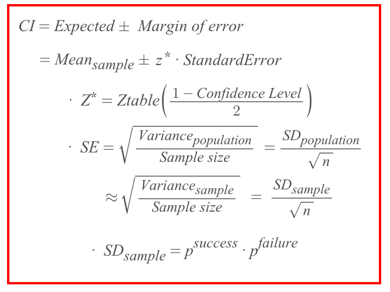

### Understanding the formula for 「Margin of Error」

Remember _Standard Error_ is `(X-μ)/Z`, 
in which `(X-μ)` is the distance from Sample to Population, so called the `Margin of Error`, 
which is the thing we're looking for.  
So doing the `Z · (X-μ)/Z = (X-μ)` is kinda **Reversing** the `normalization of the distance` back to the `real distance`.

## 「One-sample」 Z Interval
> Only take the sample once from the population.

[`▶︎ Practice at Khan academy: Calculating a z interval for a proportion`](https://www.khanacademy.org/math/statistics-probability/confidence-intervals-one-sample/modal/e/calculating-one-sample-z-interval-proportion)

[`▶︎ Tool: Omni Online Confidence Interval Calculator`](https://www.omnicalculator.com/statistics/confidence-interval)

[Refer to Khan academy: Critical value (z*) for a given confidence level](https://www.khanacademy.org/math/statistics-probability/confidence-intervals-one-sample/modal/v/critical-value-for-a-given-confidence-level)

Here is the formula for a _one-sample z interval_ for a `sample proportion`:

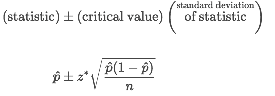

in which the _margin of error_ is:

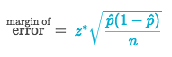

### Example
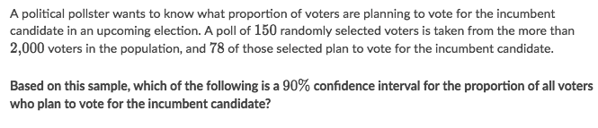
Solve:
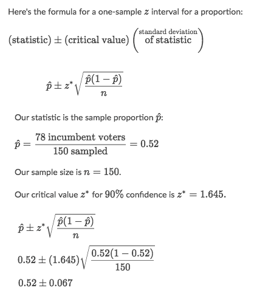

### Example
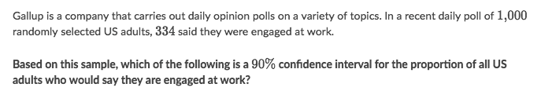
Solve:
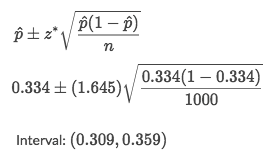

## 「Sample Size」 & 「Margin of Error」

### Example
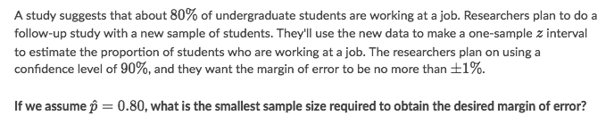
Solve:
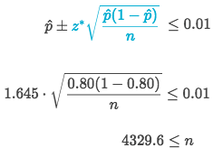

### Example
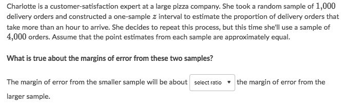
Solve:
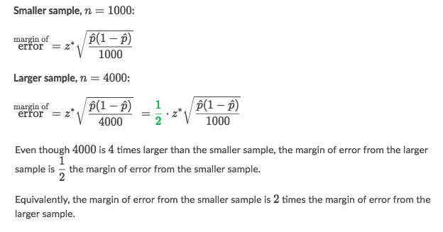

## Estimating 「Margin of Error」

[Refer to Khan academy: Determining sample size based on confidence and margin of error](Determining sample size based on confidence and margin of error)

### Example

Solve:
- We haven't been told what is the probability yet, so we have to estimate it first.
- We know the formula for _margin of error_:
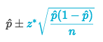
- In the formula above, if we're to set an _upper bound_ on it, we need to find the **largest margin of error**, which require either the _sample size n_ to be **smallest** or the `p(1-p)` to be **largest**.
- Since it's asking for a smallest sample size, so we need to find the **largest** `p(1-p)`.
- We've learnt the optimization from Calculus how to get the **max value** from an equation:
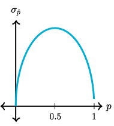
- We take the derivative of `p(1-p)` and set to 0, to get the max value: `p = 0.5`
- Calculate the rest:
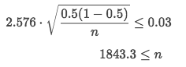

## 「Z-table」

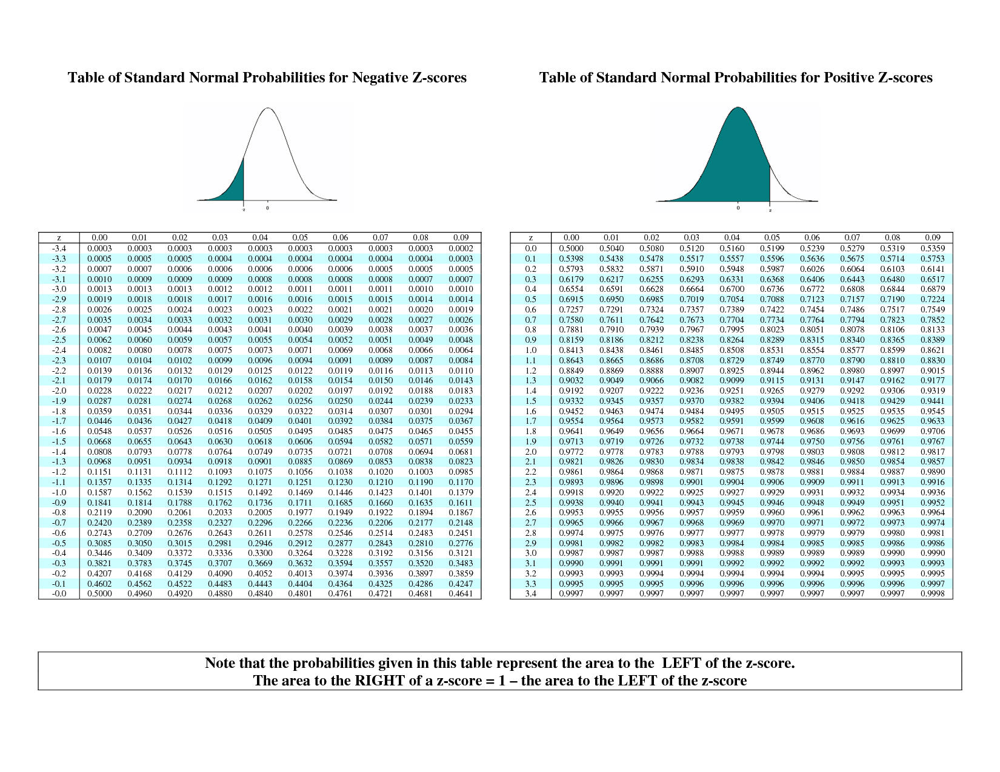
