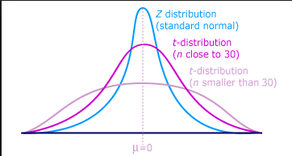
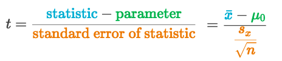
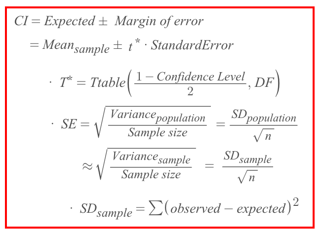
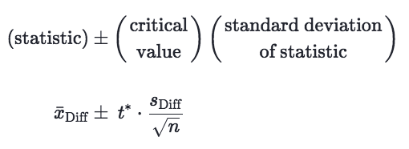
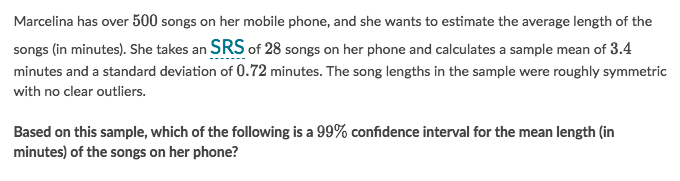
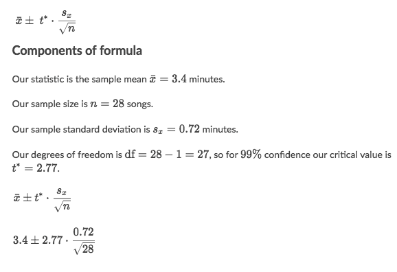
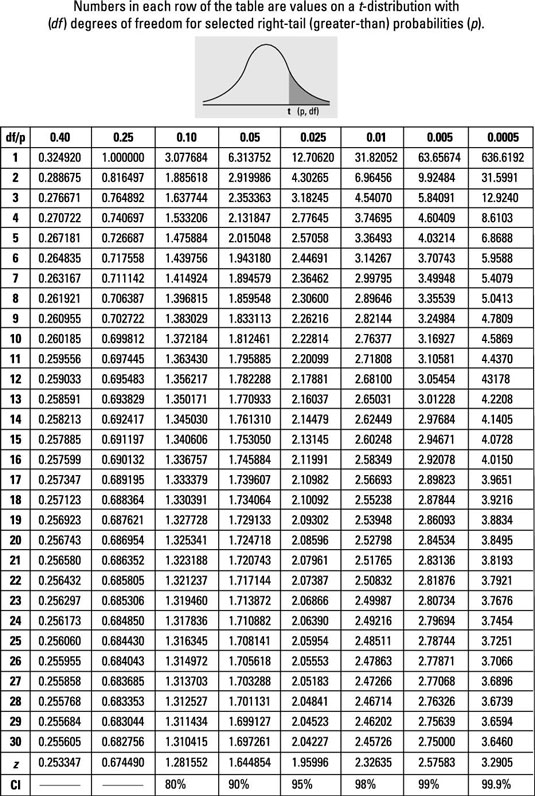

#  ❖ T-Interval (t statistics)

`T interval` is good for situations where the sample size is **small** and population standard deviation is **unknown**.

When the _sample size_ comes to be very small (n≤30), the `Z-interval` for calculating _confidence interval_ becomes less reliable estimate. And here the `T-interval` comes into place.

[Refer to Khan academy: Small sample size confidence intervals](https://www.khanacademy.org/math/statistics-probability/confidence-intervals-one-sample/modal/v/small-sample-size-confidence-intervals)

## 「T-Distribution」
> The full name is `Student's t-distribution`, which is a _tweaked version of Normal Distribution_.

[Refer to wiki: Student's t-distribution](https://www.wikiwand.com/en/Student%27s_t-distribution)

When the _sample size_ is small, the _Normal distribution_ will no longer be a good fit for estimating the population.
So we introduced the **tweaked version of Normal Distribution** for a small sample sized sampling data, which we called `T-distribution`.

### 「T-distribution」 vs. 「Normal distribution」

They have the same centre: Sample Mean.
But the tail of _t-distribution_ is **"fatter"** than the Normal distribution.

## Conditions for a valid 「T Interval」

The conditions we need for inference on one proportion are:
- **Random**:
The data needs to come from a random sample or randomized experiment.
- **Normal**:
The sample size is at least 30.
- **Independent**:
The independence condition says that when sampling without replacement, we can still treat each observation in the sample as independent as long as we sample less than 10%, percent of the population. 

## 「T-score」

[Refer to article: What is the T Score Formula?](http://www.statisticshowto.com/probability-and-statistics/t-distribution/t-score-formula/)

A `t score` is one form of a _Standardized Test Statistic_ (the other you’ll come across in elementary statistics is the z-score). 
The t score formula enables you to take an individual score and transform it into a standardized form>one which helps you to compare scores.
You’ll want to use the t score formula when you don’t know the population standard deviation and you have a small sample (under 30).

The t score formula is:

(x⁻ is the _Sample Mean_, μ₀ is mean from _null hypothesis_, sx is the _Sample SD_, n is _Sample size_)

### Understanding the formula

The `statistic - parameter` results the **DISTANCE** from _Sample mean_ to _Population mean_.
The `Standard Error` represents the **DISTANCE** from _Sample SD_ to _population SD_.
=> Therefore, dividing the `Distance of mean` by `Distance of SD` will results in a **Normalized Distance for mean**.

[`▶︎ Jump back to previous note on: Standard Error`](https://github.com/solomonxie/solomonxie.github.io/issues/50#issuecomment-417840715)

## Formula of 「T-interval」

The difference with Z-interval's formula is instead of using `Z*` value, we'll be using the `T*` value,
and the calculation of Standard Error is different too.

## 「One-sample」 T interval

### Example

Solve:

## T interval for 「paired data」

[Refer to article on Khan academy: Making a t interval for paired data](https://www.khanacademy.org/math/statistics-probability/confidence-intervals-one-sample/modal/a/one-sample-t-interval-paired-data)

## 「T-table」

