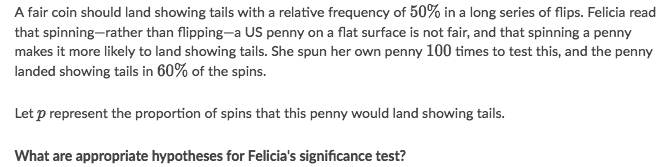
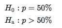
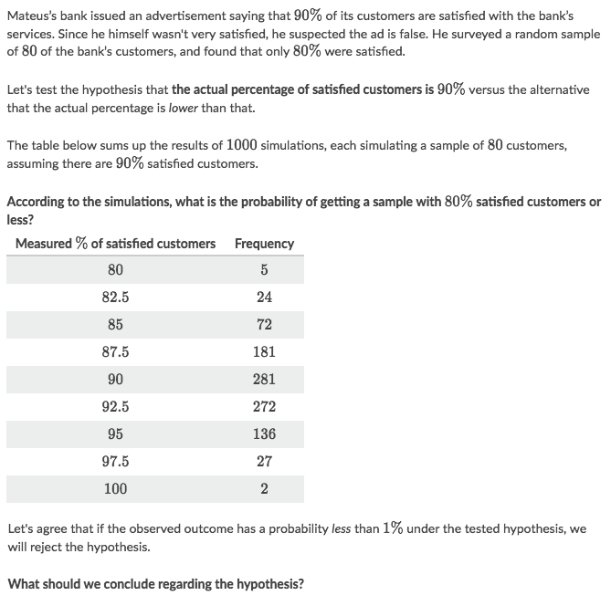
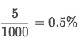
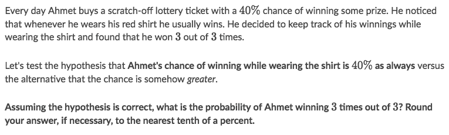

#  ❖ Hypothesis Testing

`Hypothesis Testing` is that we make a assumption, or a hypothesis about something, and we then make a test and do statistic on it as evidence to **against** the hypothesis. 

> We can **NEVER** prove the null hypothesis, because "INNOCENT UNTIL PROVEN GUILTY".

[Refer to youtube: What is a Hypothesis Test and a P-Value?](https://www.youtube.com/watch?v=vwWEa8wU_6U&t=381s)

## 「Null Hypothesis」 & 「Alternative Hypothesis」

[Refer to youtube: Hypothesis Testing 2: null and alternative hypothesis (one sample t test)](https://www.youtube.com/watch?v=L1GV6nLnbyE)

Notations:
- H₀: Null Hypothesis (reads `H-knot`)
_Null hypothesis_ is the assumption we claimed as our opinion.
- Ha: Alternative Hypothesis (reads `H-alternative`)
_Alternative hypothesis_ is the **opposition** against the _null hypothesis_.

etc., if the _null hypothesis_ is "Jason's IQ is 130", then the _alternative hypothesis_ is "his IQ is below 130".

### The 「Null Hypothesis」 H₀

The _null hypothesis_ should always contain a statement of equality. Another way of thinking of it is that the null hypothesis is a statement of "no difference." 
We can write the null hypothesis in the form:
- `H₀: parameter = value`

### The 「Alternative Hypothesis」 Ha

The alternative hypothesis could take one of three forms, depending on the context of the test:
- `Ha: parameter > value`
- `Ha: parameter < value`
- `Ha: parameter ≠ value`

### Example

Solve:

## 「Test statistic」

Test statistic is the **Normalized** value for the evidence in hypothesis, which could be:
- **Z-score** (good for sample proportions)
- **T-score** (good for sample means)

Once you get the Test statistic value in a Normal Distribution, you'll easily get the **probability area**, which you could compare with the threshold.

## 「Simple Hypothesis Testing」

### Example

Solve:
- According to the table, out of 100010001000 simulated samples:
    - 5 had 80%, percent satisfied customers
    - None had a lower measured percentage of satisfied customers
- In total, these sum up to 5 simulations out of 1000. Therefore, the simulations imply that the probability of having a sample with 80%, percent satisfied customers or less is:

- The probability we got is lower than 1%, percent. Therefore, we should reject the hypothesis.

### Example

Solve:
- Assume the 40% probability is **TRUE**,
- so the probability of getting 3 wins in a row is: `40%^3 = 6.4%`
- Therefore we SHOULDN'T reject it, because it's higher than 5%.

## Conditions for 「Inference on a proportion」

When we want to carry out inferences on one proportion (build a confidence interval or do a significance test), the accuracy of our methods depend on a few conditions. Before doing the actual computations of the interval or test, it's important to check whether or not these conditions have been met, otherwise the calculations and conclusions that follow aren't actually valid.

The conditions we need for inference on one proportion are:
- Random: The data needs to come from a random sample or randomized experiment.
- Normal: The sampling distribution of p needs to be approximately normal — needs at least 10 expected successes and 10 expected failures.
- Independent: Individual observations need to be independent. If sampling without replacement, our sample size shouldn't be more than 10% percent of the population.

