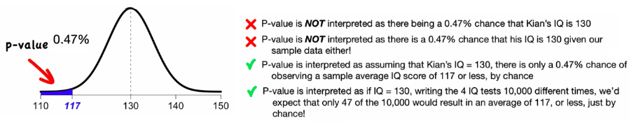
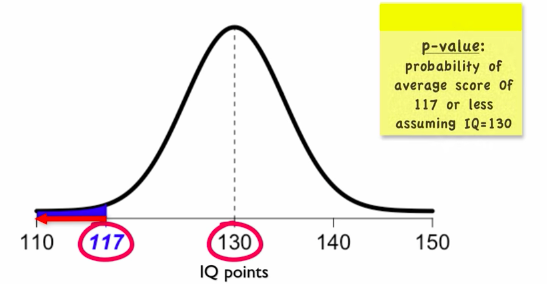
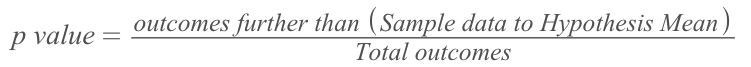
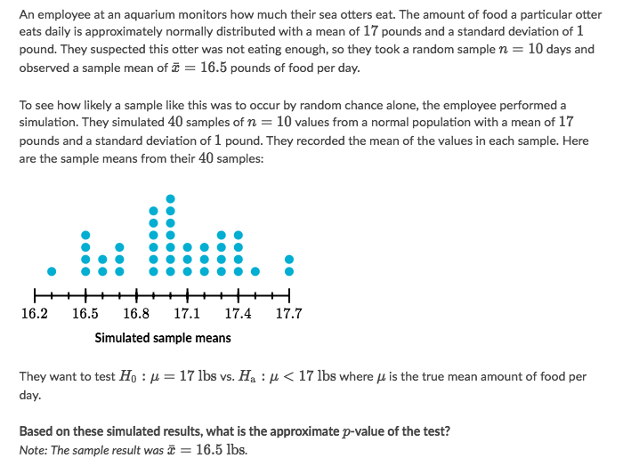
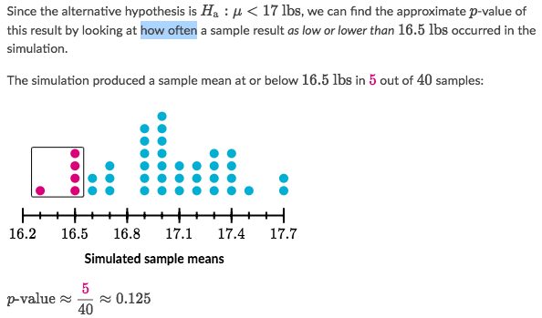
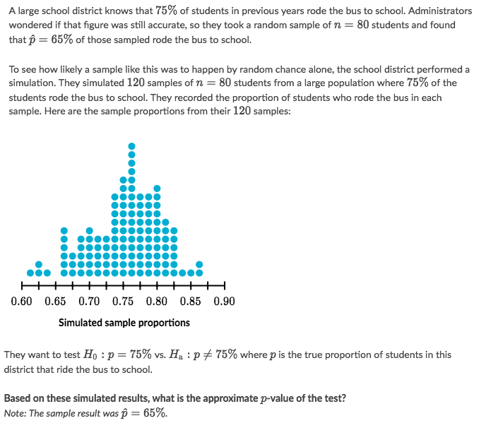
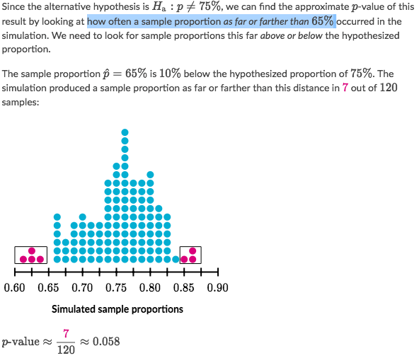
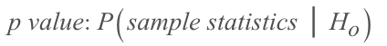
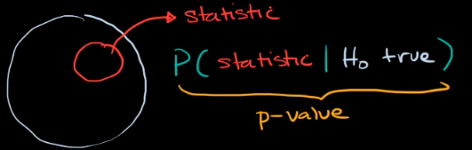

# ❖ P-value (One-tailed)

> _p-value_ stands for "probability value", which is the **most confusing concept** in Hypothesis testing. So it's necessary to pick it out here before exceeding to the Significance Testing.

[Refer to youtube: Hypothesis Testing 5: p values (one sample t test)](https://www.youtube.com/watch?v=WojcyhC7EVc)

**_p-value_ tells the MAXIMUM of the "truth" takes part in your story.**

> The smaller the true part (_p-value_) in the story, the greater the evidence against the story(_null hypothesis_).

For example, you said your IQ is 130. So we build a **MODEL** based on your claim. And then we ask you to take a real IQ test which tells your IQ is 117. So the calculation tells that the **REAL** part only takes **utmost 0.47%** in your "story". Therefore, if there is only less than 0.47% truth in a story, we can claim the story is a **LIE**! And 0.47% is the `p-value`.

## Steps to calculate 「p-value」

- First we assume the story (__null hypothesis__) is **true**,
- and we do a large number of simulations based on the story **to form a normal distribution**,
- then we take a **real sample**, 
- draw the sample data onto the **hypothesis distribution**,
- calculate how much proportion it is **from the sample data to a tail**,
- if it's not told `left-tail` or `right-tail`, then the proportion is **two-tails** adding up together.
- And that proportion is the `p-value`, as the **utmost probability of the true story in hypothesis**.

## p-value from 「Discrete Distribution」

Just to **count** how many _outcomes_ are **"further"** than the _sample data_ to the mean, divided by the total outcomes.

### Example

Solve:

### Example

Solve:

## p-value from 「Continuous Distribution」

## p-value is a  「Conditional Probability」

[`▶︎ Jump back to previous note: Conditional Probability`](https://github.com/solomonxie/solomonxie.github.io/issues/50#issuecomment-412445737)

