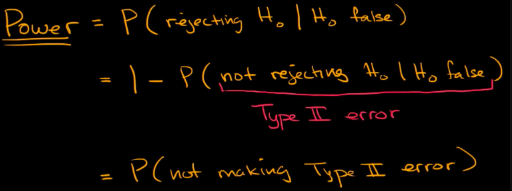
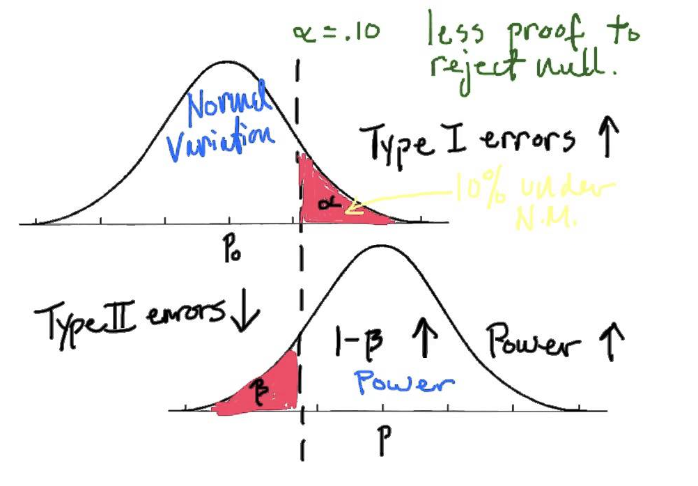
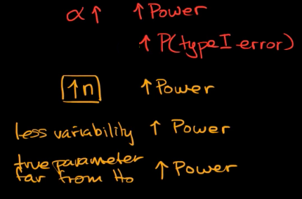
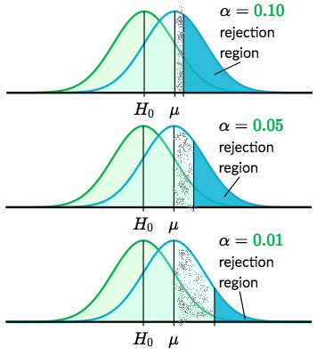
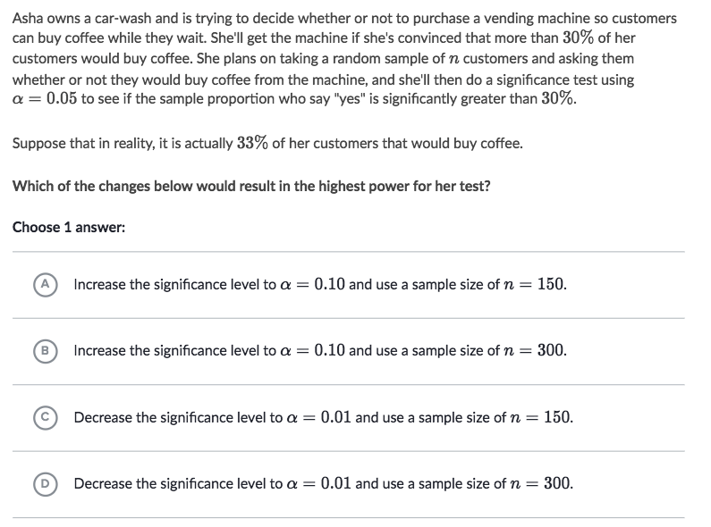
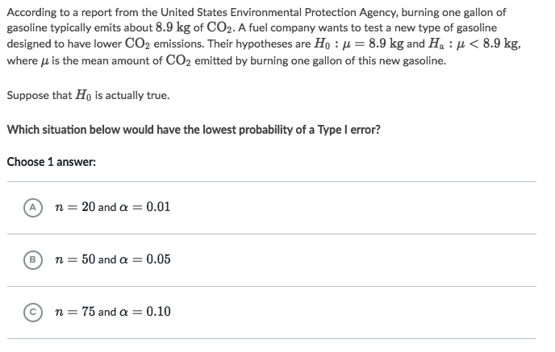

#  ❖ Statistical Power

> _Power_ is in the context of Statistical Testing, stands for a conditional probability of _REJECTING a FALSE HYPOTHESIS_.

_"power -> power of justice -> ability to remove the bad one"_

## 「Truth World」 & 「Lies World」

Note that, the Power is a `Conditional Probability`, on the condition of `False null hypothesis`.

> That being said, the distribution is NOT built on the `null hypothesis is true` anymore, but on the `null hypothesis is false`.

## How to increase 「Power」
**Power is the likelihood that our sample result leads us to correctly reject a false null hypothesis.**

The **main purpose** of studying the power is to get more chance to do the RIGHT thing.

There're two main settings affect the _power_ of a significance test:
- Significance level: positive impact
- Sample size: positive impact

## Impact of 「Significance Level」 ⍺

- Higher ⍺  -> Higher Power & Type I Error  ->  Lower Type II Error
- Lower ⍺ -> Lower Power & Type I Error -> Higher Type II Error

The logic is:
- **Lower** ⍺ -> closer -> smaller "reject region" -> less chance to reject
- **Higher** ⍺ -> farther -> larger "reject region" -> more chance to reject

## Impact of 「Sample Size」

**Larger sample sizes increase power.**

### Example

Solve:
- To increase power, we want to increase the Significance Level & Sample size as much as possible.

### Example

Solve:
- To decrease the Type I Error, we want to decrease the Significance Level & Sample size as much as possible.
