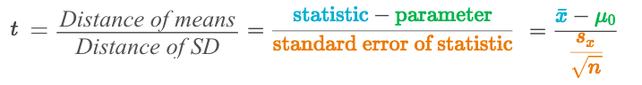
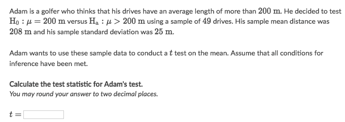
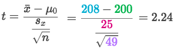
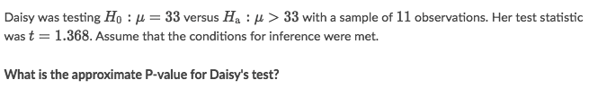
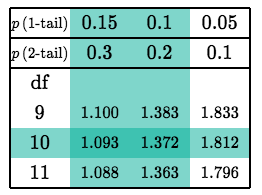
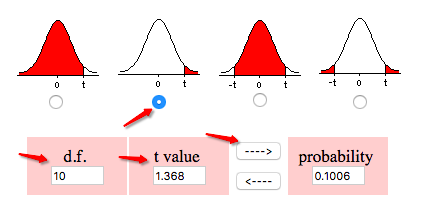
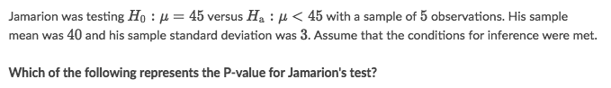
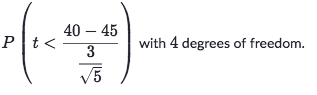

#  ❖ T Test (t statistics)

[Refer to article: Understanding t-Tests: t-values and t-distributions](http://blog.minitab.com/blog/adventures-in-statistics-2/understanding-t-tests-t-values-and-t-distributions)

T-tests are all based on `t-values`. 
T-values are an example of what statisticians call `Test statistics`. A test statistic is a standardized value that is calculated from sample data during a hypothesis test. 
The procedure that calculates the test statistic compares your data to what is expected under the null hypothesis.

[`▶︎ Jump back to previous note on: T-score`](https://github.com/solomonxie/solomonxie.github.io/issues/50#issuecomment-418987783)

[`▶︎ t-distribution online calculator`](https://surfstat.anu.edu.au/surfstat-home/tables/t.php)

## Formula of 「One-sample T test」 for Mean

The test statistic gives us an idea of how far away our sample result is from our null hypothesis. 

For a one-sample t test for a mean, our test statistics is:

(x⁻ is the _Sample Mean_, μ₀ is mean from _null hypothesis_, sx is the _Sample SD_, n is _Sample size_)

> Understanding the formula:
The `statistic - parameter` results the **DISTANCE** from _Sample mean_ to _Population mean_.
The `Standard Error` represents the **DISTANCE** from _Sample SD_ to _population SD_.
Therefore, dividing the `Distance of mean` by `Distance of SD` will results in a **Normalized Distance for mean**.

## Calculating the 「test statistic」 in a t test for a mean

### Example

Solve:

## Calculating the 「P-value in a t test」 for a mean

### Example

Solve:
- Since the sample size = 11, so the degree of freedom is 10.
- Take a T-table and look for a cross section of `df=10 & t=1.368`

- Since our test statistic is slightly smaller than 1.372, the corresponding P-value will be slightly larger than 0.10
- The P-value is approximately 0.101
- Or another way is to use an online calculator: [SurfStat t-distribution calculator](https://surfstat.anu.edu.au/surfstat-home/tables/t.php)

### Example

Solve:

