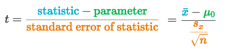
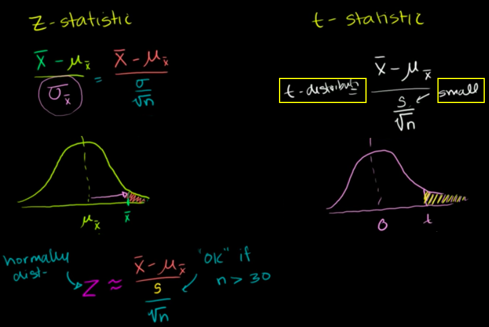

#  ❖ 「Z Test」 vs. 「T Test」 (One-sample)

[Refer to Khan academy: When to use z or t statistics in significance tests](https://www.khanacademy.org/math/statistics-probability/significance-tests-one-sample/modal/v/when-to-use-z-or-t-statistics-in-significance-tests)

[`▶ Jump back to previous note on: Z Test`](https://github.com/solomonxie/solomonxie.github.io/issues/50#issuecomment-420189772)
[`▶ Jump back to previous note on: T Test`](https://github.com/solomonxie/solomonxie.github.io/issues/50#issuecomment-420521963)

## Formulas

> Proportion -> Z-test
   Mean -> T-test

Z test for proportion:

T test for mean:

## 「Z-statistics」 vs. 「T-statistics」

[Refer to Khan academy: Z-statistics vs. T-statistics](https://www.khanacademy.org/math/statistics-probability/significance-tests-one-sample/modal/v/z-statistics-vs-t-statistics)
[Refer to Khan academy: Small sample hypothesis test](https://www.khanacademy.org/math/statistics-probability/significance-tests-one-sample/modal/v/small-sample-hypothesis-test)
[Refer to Khan academy: Large sample proportion hypothesis testing](https://www.khanacademy.org/math/statistics-probability/significance-tests-one-sample/modal/v/large-sample-proportion-hypothesis-testing)

> Large sample size -> Z-test
   Small sample size -> T-test

