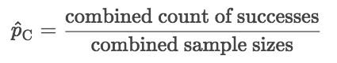
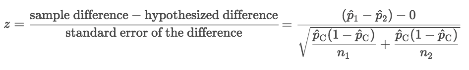
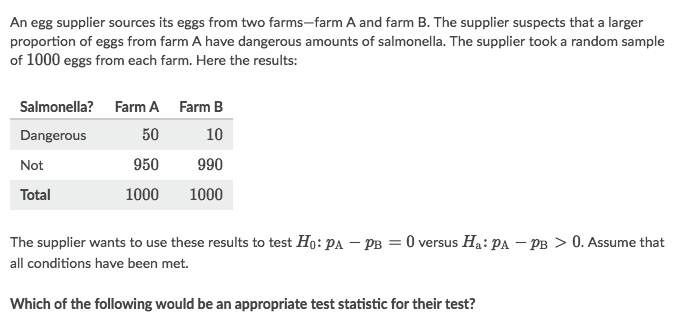
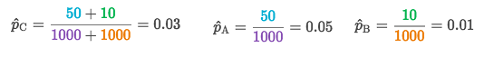
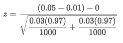
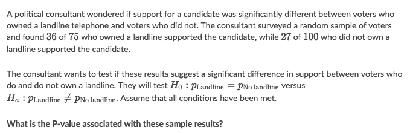
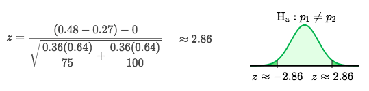
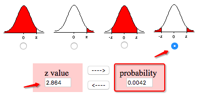

#  ❖ Significant Difference Test (Proportions)

> "_Hypothesis Test for difference_", which sounds more intuitive with _significant different test_ because it's testing for a significant difference.

[Refer to Khan academy: Hypothesis test for difference in proportions](https://www.khanacademy.org/math/ap-statistics/two-sample-inference/modal/v/hypothesis-test-for-difference-in-proportions)

[`▶ Jump back to previous note on: One-sample Z Test`](https://github.com/solomonxie/solomonxie.github.io/issues/50#issuecomment-420189772)

> Reminder: One-sample Z Test

## Formula for 「Two-Sample Z Test」

Combining the proportion of successes
In this type of test, it's useful to first calculate the pooled (or combined) proportion of successes in both samples:

> We do significance tests assuming that the null hypothesis is true. In this test, our null hypothesis is that the two population proportions are equal, but we don't have a hypothesized value for their common proportion. Our best estimate for this value is Ṕc. We'll use this pooled (or combined) value in the standard error formula where we'd ideally use each population proportion.

The `Hypothesis difference` is 0 when `H₀: p1 - p2 = 0`.

## Z-value in 「Two-sample Z Test」

### Example

Solve:
- Combining the proportion of successes:

- Input values to formula:

## P-value in a 「Two-sample Z Test」

### Example

Solve:
- Calculate `z-score`:

- Since the Alternative hypothesis is `Ha: p1 ≠ p2`, so we're to add up **both tails** of probabilities:

