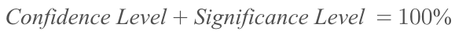
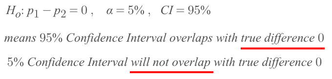
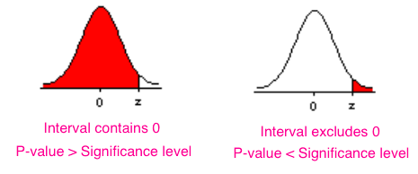
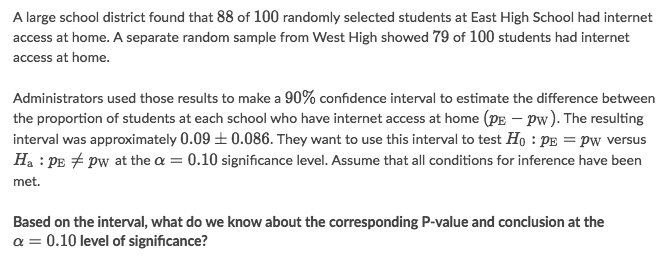

#  ❖ 「Confidence Interval」 for 「Hypothesis Test」

[Refer to Khan academy: Confidence interval for hypothesis test for difference in proportions](https://www.khanacademy.org/math/ap-statistics/two-sample-inference/modal/v/confidence-interval-for-hypothesis-test-for-difference-in-proportions)

[`▶︎ Jump back to previous note on: Confidence Interval`](https://github.com/solomonxie/solomonxie.github.io/issues/50#issuecomment-418060445)
[`▶︎ Jump back to previous note on: Significance Test`](https://github.com/solomonxie/solomonxie.github.io/issues/50#issuecomment-419806342)

In a two-sided test, the null hypothesis says there is no difference between the two proportions. In other words, the null hypothesis says that the difference between the two proportions is 0. 

We can use a confidence interval instead of a P-value for two-sided tests as long as the confidence level and significance level **add up to 100%**.

For example, 

That being said, if the `Confidence Interval` **DOES NOT** overlap with the _Null Hypothesis Difference_, 0 in this case, then the "true difference" will fall into the Significance Level, which should be reject. 

- CI exludes 0 ▶   P-value < Significance level   ▶ Not reject
- CI contains 0 ▶  P-value > Significance level  ▶ Reject

### Example

Solve:
- Since the _null hypothesis difference_ is 0 (H₀: pe-pw=0),
- so we're to examine if the _confidence interval_ contains the "assumed difference" 0
- Surely the interval `0.09±0.086` contains 0, 
- therefore the hypothesis should NOT be rejected.

