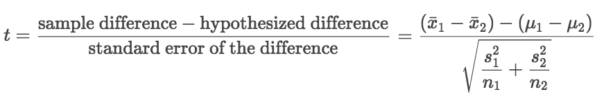
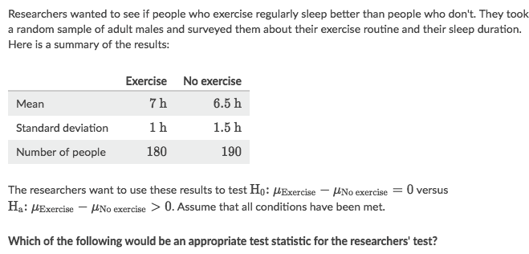
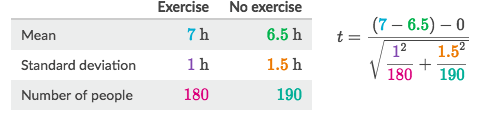
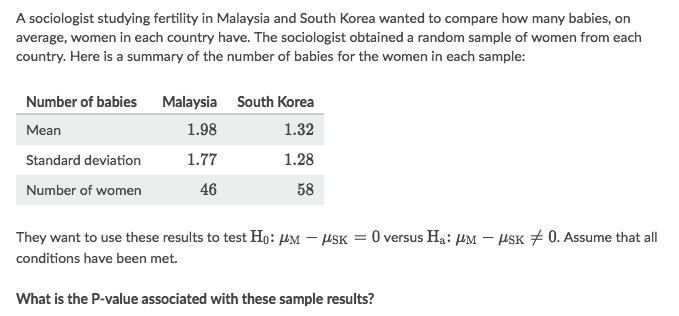
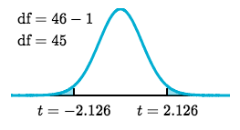
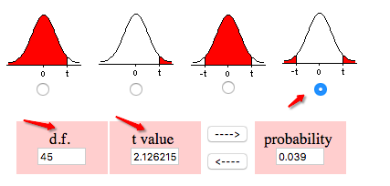
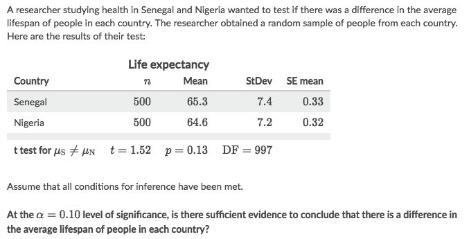
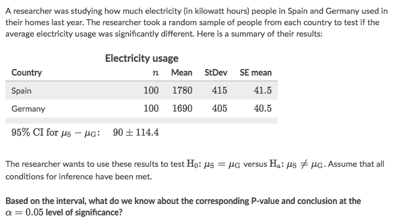
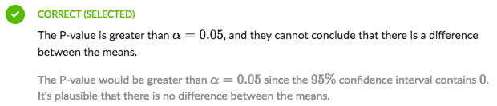

#  ❖ Significant Difference Test (Means)

[`▶ Jump back to previous note on: One-sample T test`](https://github.com/solomonxie/solomonxie.github.io/issues/50#issuecomment-420521963)

> Reminder: One-sample T Test

## Formula for 「Two-sample T Test」

The difference `μ1 - μ2` comes from the null hypothesis. In this type of test, we assume `μ1 = μ2` in the population means, which results in `μ1 - μ2 =0`.

## 「T-value」 for Two-sample Test

### Example

Solve:

## 「P-value」 for Two-sample Test

For the _Degree of freedom_ in the Two-sample Test, we're gonna use the **SMALLER** sample size.

### Example

Solve:
- Calculate the _t-value_ to get `t=2.12621542`
- Decide `df`, which will be the **smaller** sample size `46- 1 = 45`
- Since it's asking `Ha: μ1 ≠ μ2`, so we're to calculate **both tails**:

- Get an online calculator and input the values:

## Use 「CI」 to make conclusions about the 「difference of means」

[`▶︎ Jump back to previous note: Significance Testing`](https://github.com/solomonxie/solomonxie.github.io/issues/50#issuecomment-419806342)

Normally, we can make conclusion simply by comparing `P-value` with `Significance level`.

But there're cases ask us to make conclusion by comparing `Confidence level` with `Significance level`.
In that case, we can judge it by simply examine whether the **Confidence interval** covers `0` or not.

Since `Confidence Level + Significance Level = 100%`:
- CI exlcudes 0 ▶ Smaller interval & larger significance ▶ Significance level > P-value ▶ Not reject
- CI includes 0 ▶ Larger interval & smaller significance ▶ Significance level < P-value ▶ Reject

### Example

Solve:
- No, because the `P-value > ⍺`, means there's no sufficient evidence against the null hypothesis.

### Example

Solve:

