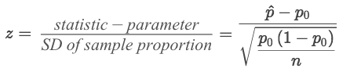
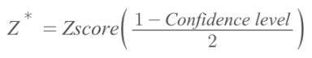
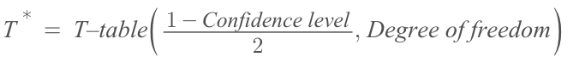

#  ❖ 「Z Statistic」 vs. 「T Statistic」

[`▶ Jump back to previous note on: Z Test vs. T Test (One-sample)`](https://github.com/solomonxie/solomonxie.github.io/issues/50#issuecomment-420542201)

## 「One-sample」

[Refer to Khan academy: When to use z or t statistics in significance tests](https://www.khanacademy.org/math/statistics-probability/significance-tests-one-sample/modal/v/when-to-use-z-or-t-statistics-in-significance-tests)

[`▶ Jump back to previous note on: Z Test`](https://github.com/solomonxie/solomonxie.github.io/issues/50#issuecomment-420189772)
[`▶ Jump back to previous note on: T Test`](https://github.com/solomonxie/solomonxie.github.io/issues/50#issuecomment-420521963)

### Formulas

> Proportion -> Z-test
   Mean -> T-test

One-sample Z test for proportion:

One-sample T test for mean:

### 「Z-statistics」 vs. 「T-statistics」

> Large sample size -> Z-test
   Small sample size -> T-test

## 「Two-sample」

[`▶ Jump back to previous note on: Significant Different Test (Proportions)`](https://github.com/solomonxie/solomonxie.github.io/issues/50#issuecomment-420589391)
[`▶ Jump back to previous note on: Significant Different Test (Means)`](https://github.com/solomonxie/solomonxie.github.io/issues/50#issuecomment-421259362)

### Formulas

> Proportion -> Z-test
   Mean -> T-test

Two-sample Z test for proportion:

Two-sample T test for mean:

## Z & T 「Confidence Intervals」

### Formulas

Z-score for CI:

T-score for CI:

