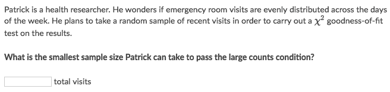
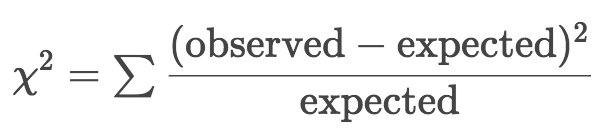
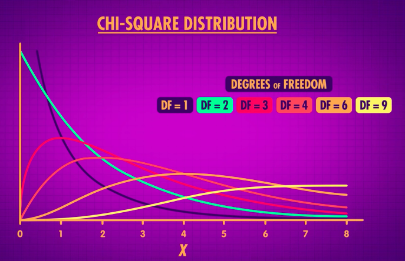
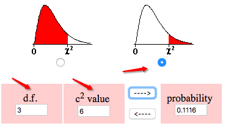

#  ❖ Chi-Squared Testing [DRAFT]

> _Chi_ is written as greek letter `𝐗`, looks like x, reads "kai".
_Chi-squared_ is written as `𝐗²`.

Like **Z-score** in a _Normal Distribution_ for a _Z-test_, 
**T-score** in a _T-Distribution_ for a _T-test_, 
𝐗² is the "Test statistic" in _Chi-square Test_, which converts sample data to a **standardized value** in a _Chi-square Distribution_.

> _Chi-square Test_ is a hypothesis test for categorical data.

[Refer to wiki: Chi-squared test](https://www.wikiwand.com/en/Chi-squared_test)
[Refer to Khan academy: Chi-square statistic for hypothesis testing](https://www.khanacademy.org/math/ap-statistics/chi-square-tests/modal/v/chi-square-statistic)
[Refer to Crash course: Chi-Square Tests: Crash Course Statistics #29](https://www.youtube.com/watch?v=7_cs1YlZoug)

## Conditions for a goodness-of-fit test

- **Random condition**: The data came from a random sample from the population of interest, or a randomized experiment.
- **Independent condition**:  If we sample without replacement, our sample size should be less than **10%** of the population so we can assume independence between members in the sample. 
- **Large counts condition**
Each _Expected count_ need to be at least **5**. 
(No conditions attached to the _observed counts_)

### Example

Solve:
- The large counts condition says that all expected counts need to be at least 5
- Patrick needs to sample enough visits so that he expects each day of the week to appear at least 5 times. There are 7 days in the week, so he needs to sample at least 5*7=35 visits.

## Formula of 「Chi-squared Test statistic」

How to understand the formula?
It's not hard to see this a way to **standardized** the data:
- `Observed - Expected` gets the _Distance_,
- `()²` eliminates the negative results,
- `÷ Expected` **unweights** the data, so that the value will fit to the Standardized Distribution, similar to the concepts of _Unit Circle_ or _Unit Vector_.

## 「Chi-squared Distribution」

## 「P-value」 for Chi-squared Test

## 「Type 1」: Chi-square Goodness-of-Fit Test
> Tests how well certain proportions fit our sample, which only has ONE variable(row).

## 「Type 2」: Tests of Independence`
> Look to see whether being a member of ONE CATEGORY is **independent** of THE OTHER, which has TWO variables (rows).

## 「Type 3」: Tests of Homogeneity`
> It's looking at whether it's likely that **Different samples** come from the **Same population**.

