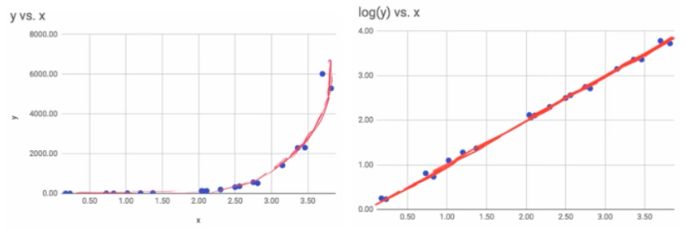
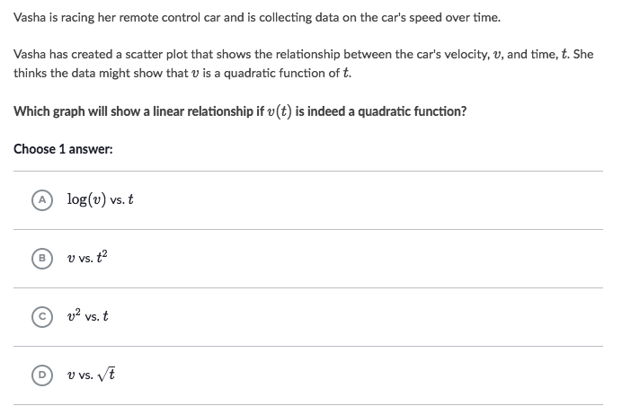
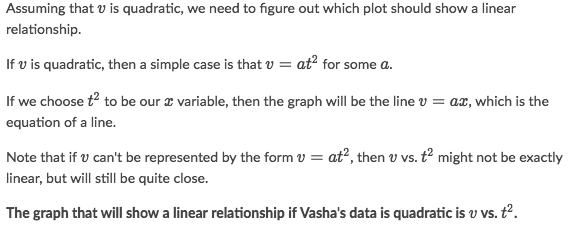
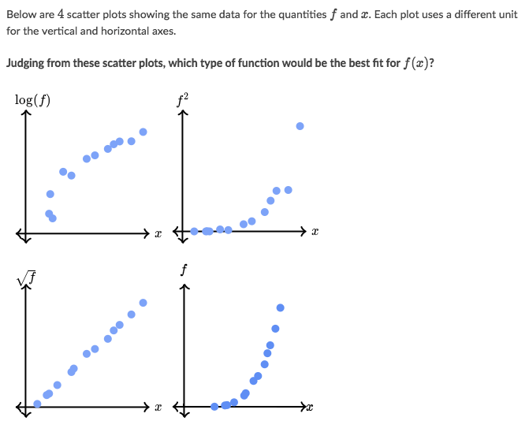
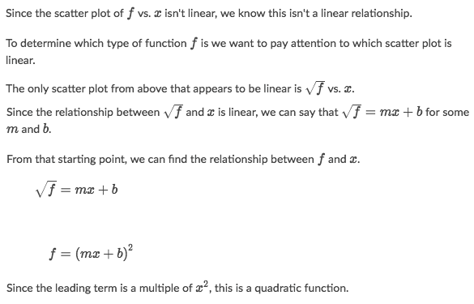

# Non-Linear Transformation

> The goal is to transform Non-linear relationship to Linear relationship, which is much easier to calculate and predict.

[Refer to Khan academy: Transforming nonlinear data](https://www.khanacademy.org/math/ap-statistics/inference-slope-linear-regression/modal/v/transforming-nonlinear-data)
[Refer to article: Non-Linear Transformation](https://people.revoledu.com/kardi/tutorial/Regression/nonlinear/NonLinearTransformation.htm)

There are several non-linear curves that that can be transformed into linear curves.

### Example

Solve:

### Example

Solve:

