# Before starting Machine Learning
> Just want to know what is a real ML engineer, is it being a programmer, or more likely being a data scientist?

### 参考文章：[成为一名 AI 工程师永远都不晚](http://geek.csdn.net/news/detail/248479)

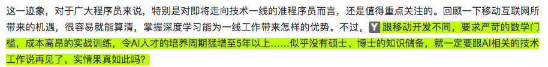
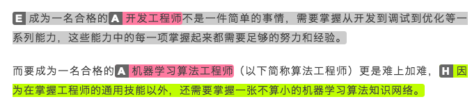
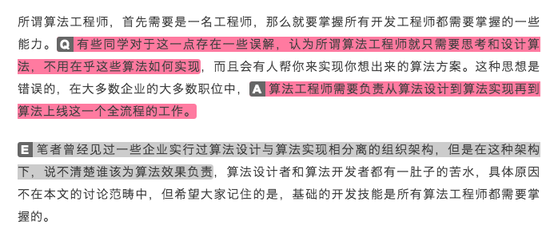
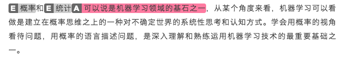
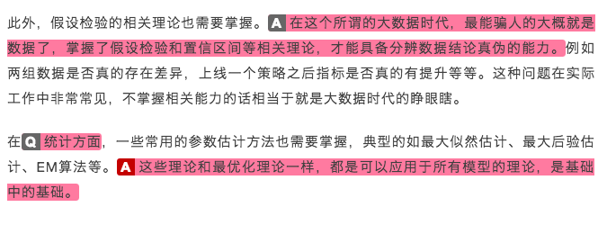
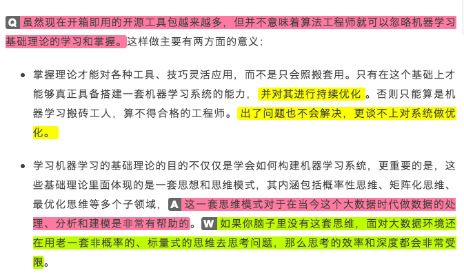

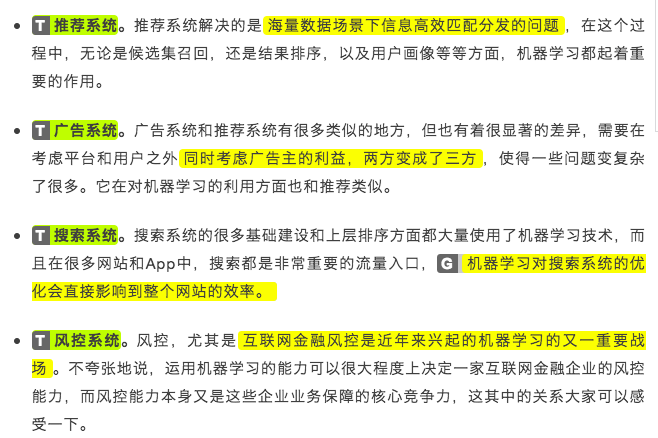
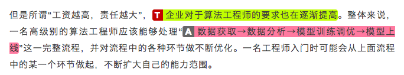

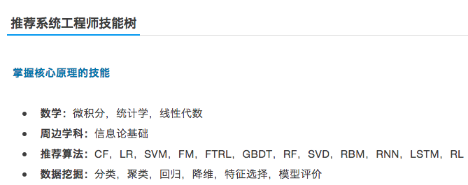

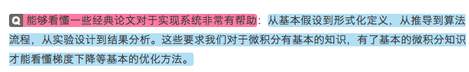

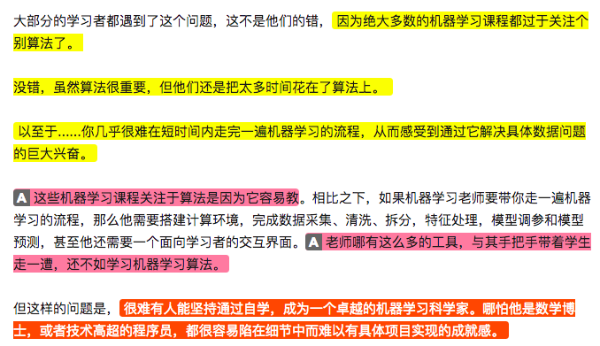
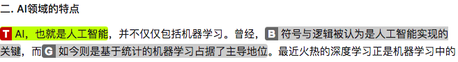
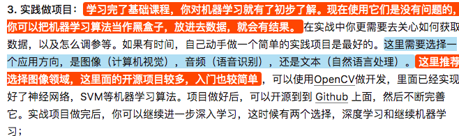
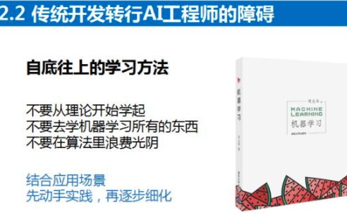
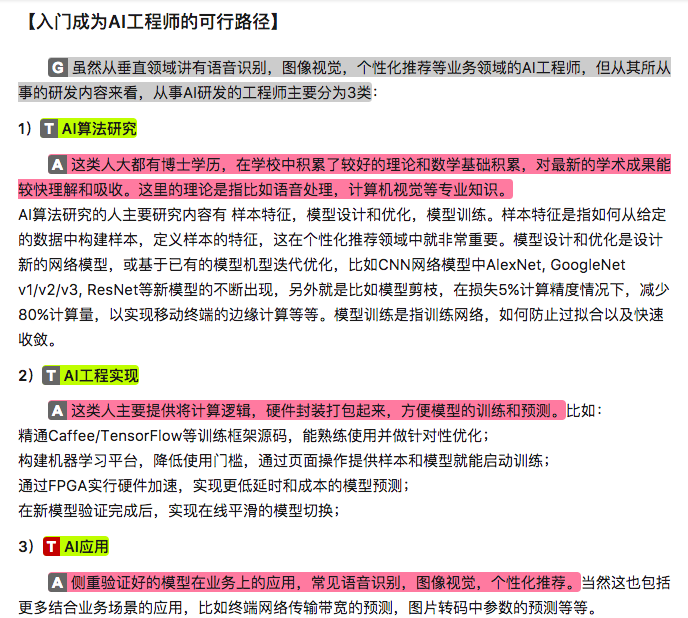
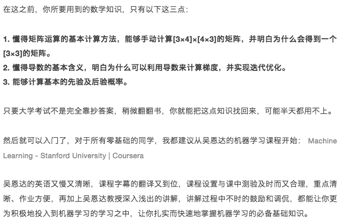
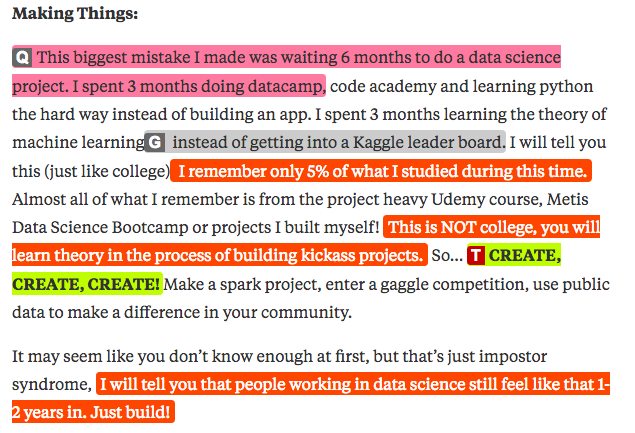
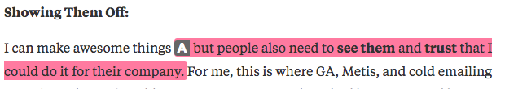
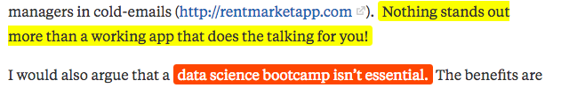
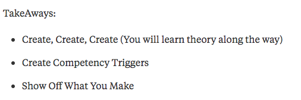
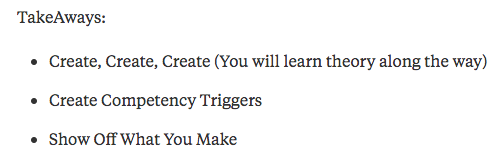

