# `Essence Linear Algebra` : `Vector` section notes
> Wherever you learn LA, which always the first to mention is the VECTOR.

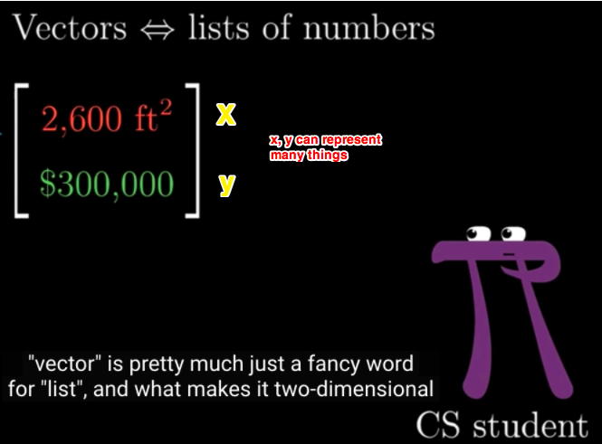

Put the coordinate, or say, the position indicator, on a axis, and put a narrow from the origin to it, It becomes a VECTOR.
So a vector contains a meaning of movement, from origin to the position, rather than just a position itself.

## Why does it have to be `x, y` on Axis and why is it 90° rather than other?
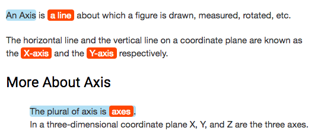

The official name for it is **Cartesian coordinate system**(笛卡尔坐标体系) according to [the wikipedia page](https://en.wikipedia.org/wiki/Cartesian_coordinate_system).
It doesn't have to be perpendicular, actually there's a `Oblique Coordinates System` that axes use angles, but it's only applied to early systems. 
Nowadays theories are most commonly take perpendicular axes as module for its convenience and applicablility to other systems. 
Wikipedia explains:

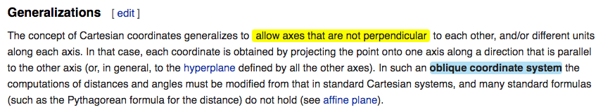

For simply distinguishing, can read [this page in madarine](https://baike.baidu.com/item/%E7%AC%9B%E5%8D%A1%E5%B0%94%E5%9D%90%E6%A0%87%E7%B3%BB?fr=aladdin).

## FOUR-STEP PATH (Vector + Vector)
Perfectly explains why two coordination(list, or say, vector) can be added! 
Literally means how much distance to walk, how much walk horizontally and vertically. 
Since two vectors were added together means how much we move on the axis(on x and on y), instead of taking 4 steps we can just make it one step directly to the final point, the same final place. 
And draw an arrow from origin to it, then everything construct a beautiful triangle. 

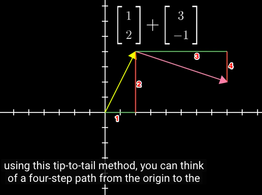

And two lists(vectors, coordinates)  much contain exact the same amount of distance indicator(number), otherwise it doesn’t make sense at all.
2D, here it simply just means there’re two distance number in the list, like (2,-3). 
So 3D means three distance number in the list, (2,-3, 5). 
No matter how many dimensions are represented here, all we need to care about is how many pair of numbers we need to operate(add or multiply).

## SCALING  (Multiplication of vector by a number)
`SCALING` is what we say multiplication of a vector. 
Literally just stretching, squishing or reversing direction of the vector(the position).

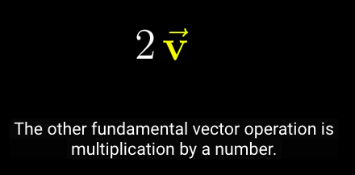

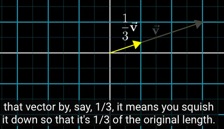

And the number(multiplier) besides the vector(position), we call it `SCALARS`, 
Literally means how much we scale the vector(scale the movement from origin to the position, closer or further, forward or backward). 
The scalar we also just call it `number` sometimes.

## VECTOR ADDITION & SCALAR MULPIPLICATION.
It's the two Fundamental operation of vectors.

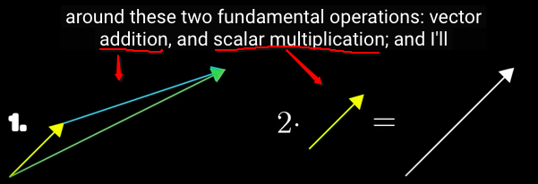

Addition means moving the tip of an arrow to another position, multiplication means to scale the arrow line itself bigger or smaller.

## BASIS OF VECTORS
`i-hat` is a unit-vector (1 unit), only indicate x-distance. 
When it’s with a number(scalar), `i-hat` can be stretched or squished. 
Same with `j-hat`.  

And i-hat and j-hat are called a pair of `BASIS VECTORS`.
When adding two vectors(both with scalars) together, it becomes like this.

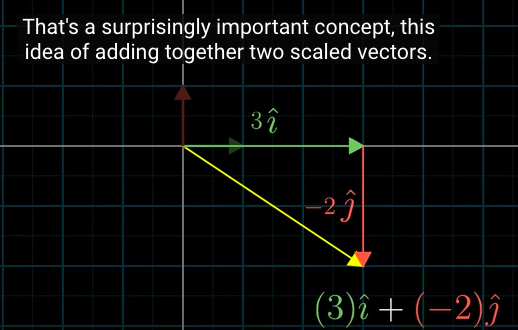

## LINEAR COMBINATION 
The combination of two vectors(the result), is the 3rd line from the triangle. It’s a direct line from this tail to that tip, so it’s linear result(combination).
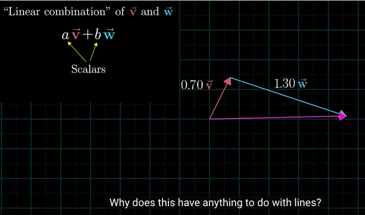

## SPAN
with two vectors, depends on situation(is one’s value already set up, or both aren’t set up and can be anywhere), and we scale them to all possible places, and what places it covers, is the SPAN of the two vectors.
If one is settled scaling rate, like -1.44, so no matter how much the other one move, all the movement will only draw a single line.

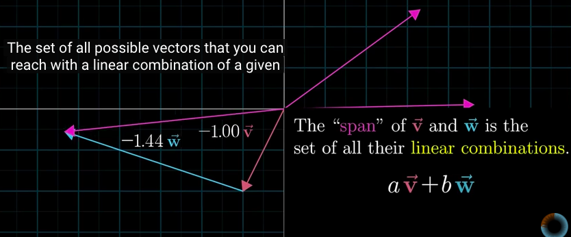

## `LINEARLY DEPENDENT` and `LINEARLY INDEPENDENT`
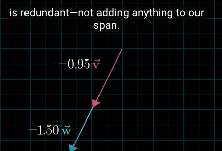
In the case two-dimension, if two vectors line up then it makes no space but a line, in three-dimension no sphere but a sheet. 
So if any vector lines up with another, we call it `LINEARLY DEPENDENT`. Vice versa, if it makes space then we call it `LINEARLY INDEPENDENT`.
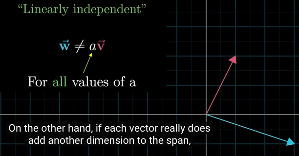
## VECTOR SPACE
Only when vectors are linearly independent (not collapse with any other vector), its span can draw a space.
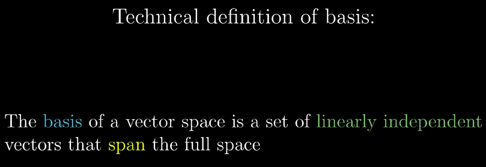

