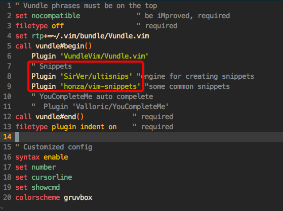

#  ❖ Vim UltiSnips自动补全 （Python强依赖）

> 想要Vim像Sublime一样快速编程，就需要各种好的snippets快速生成一段预备好的代码。一般常用的插件是`UltiSnips`作为生成代码的引擎，`Vim-snippets`插件作为各种语言的常用语句包。

**注意：此插件极其依赖Python特定版本，一旦本地python版本有一丁点变动，整个vim的使用都会完全受阻！**

## 安装Snippets插件
在已有Vundle插件管理器的基础上，直接在`.vimrc`文件中加入这两个插件名：



然后退出vim再进入vim，输入命令: `:PluginInstall`，等待安装完成后，重新进入vim，就可以正常使用了。

## 创建snippets
相比于sublime， 在vim中创建snippets是稍微麻烦点。主要跟随这几点：
- 找到插件目录，是位于`~/.vim/bundle/`下的`ultisnips`和`vim-snippets`。
- 不要在`vim-snippets`中预备好的各语言snippets上直接修改，因为每次更新都会被覆盖。
- 必须在`ultisnips`文件夹下创建一个`UltiSnips`文件夹，所有自定义代码都存在这里。
- 自定义的代码片段必须给每个语言创建单独文件，保存的文件名必须遵循`语言名.snippets`格式.如果是运用到所有文件上的，就叫`all.snippets`。
- 文件保存后即刻生效，无需重启vim。
- 代码片段文件里面需要遵循如下格式：
```vim
snippet  关键词 "描述" 生成模式
代码片段
endsnippet
```
其中，生成模式有很多种，一般为`b`，即只有在一行的开头输入关键词时，才会调用代码片段。其它还有b, A, w, i等模式，具体可以在vim 的`:help ultisnip`中查看文档。

举个例子，我们要为html文件做一些快捷代码，那么：
首先创建、或修改一个snippets文件：
```sh
$ vim ~/.vim/bundle/ultisnips/UltiSnips/html.snippets
```

然后添加如下格式的声明：
```vim
snippet html "create html 5 structure" b
<!DOCTYPE html>
<html>
<head><title></title></head>
<body>
</body>
</html>
