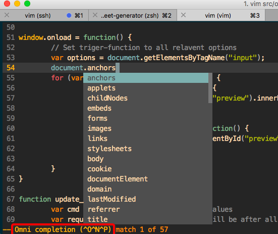

# Vim原生补全工具 OmniComplete

用了一天倒腾自动补全插件，实在是崩溃，但凡有点名气的都对vim本身的编译有很麻烦的要求。搜索过程中才发现Vim其实是自带补全功能的，称为`OmniComplete`。
输代码的过程中，直接按`Ctrl+X`然后再按`Ctrl+O`，就会弹出vim猜测的一系列补全内容。可以在菜单里按“上下键”选择，注意是方向上下键，不是JK键。
经过测试，原生支持很多种语言。

