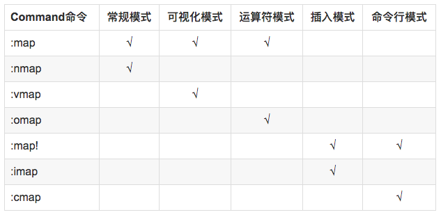

#  ❖ Vim键盘映射入门

> 之前一直在找方法将`Capslock`键映射为`Esc`键，这样vim中就不用每次跑很远去按Esc了。可惜MacOS最新版的系统都无法很好兼容市面上的键盘映射软件，就放弃了。
然后发现Vim其实本身就可以设置键盘映射，这样大好，原本对Key Mapping需求多的也只有Vim而已，其它地方不太需要这么乱七八糟的改键。

[参考：利器系列之 —— 编辑利器 Vim 之快捷键配置](http://blog.guorongfei.com/2015/09/03/vim-shortcut/)
[参考：VIM键位映射总结](https://blog.csdn.net/jalused/article/details/42708429)

## 递归绑定和非递归绑定
Vim 的快捷键绑定分为递归和非递归两种，比如：
```
" 非递归方式 (No-re-map) 不会把a转嫁到c
noremap a b
noremap b c

" 递归方式 (会把a转嫁到c)
map a b
map b c
```




## 改键方法
- 方法一：直接在Vim中输入命令
`:map 原键 新键`,只是临时的改变，一般人都不怎么用。
- 方法二：在`.vimrc`中配置
打开文件后，随便找个地方加入改键命令即可。

## 特殊名称
```
<ESC> ESC键
<BS> backspace退格键
<CR> ENTER回车键
<Space> 空格键
<Shift> shift键
<Ctrl> ctrl键
<Alt> alt键
<F1>-<F12> F1到F12功能键<k0>-<k9> 小键盘数字0到9
<S-x> 大写S配合x，意味着shift+x组合键
<C-x> 大写C配合x，意味着ctrl+x组合键
<A-x> 大写A配合x，意味着alt+x组合键
```


## 常用映射

### `CapsLock`
注意：CapsLock在vim中无法被捕获，所以必须用额外的软件才可以达到。
Windows非常简单，用Autohotkey全解决。Mac可以用Karabiner。

### 括号自动补全
```vim
inoremap ( ()<Esc>i  
inoremap [ []<Esc>i  
inoremap { {}<Esc>i  
```
