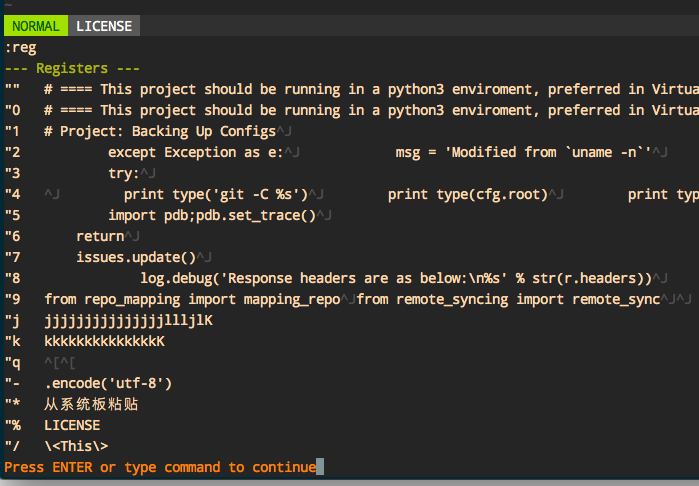

#  ❖ 复制粘贴有那么麻烦吗？理解VIM的文本复制

> Vim的文本复制，逻辑上要比我们日常的拷贝、粘贴要复杂些。

之前看了很多文章，真是太复杂了，复制个东西搞得好像系统性的工程建设一样。其实两句话就解释明白的。
[参考这篇文章：vim的剪切板](https://segmentfault.com/a/1190000000382847)

首先输入`:reg`命令，查看Vim记录的所有剪切板内容，大概是这样的：



常用命令：
```vim
:reg        #查看所有注册的剪切板内容

""            #Vim内部的默认剪切板

"+           #Vim外部的剪切板，也就是系统的剪切板, 复制粘贴到它就能和其他编辑器交互了

"3y        #把文本复制到第3个剪切板

"+y        #复制到系统板

"+p        # 从系统板粘贴
```

### 举例1（Vim内部复制粘贴）：
在Normal模式下，用`v`命令开始选择文本，然后按下`"1y`，就把已经选中的文本存到了`编号1`的剪切板。需要用的时候，就在vim中进入Normal模式，然后按下`"1p`，就粘贴出来啦。

### 举例2（Vim与系统其他程序交换复制粘贴）:
随便在网页里复制一段话，然后进入vim的Normal模式，按下`"+p`，就把刚才的文字粘贴出来了。
反过来，在Vim的Normal模式下，按`v`命令开始选择一段文本，然后按下`"+y`，就把文字复制到系统的剪切板了，随便找个文本编辑器如Sublime Text，按`Ctrl+v`，就会发现刚才复制的内容粘贴出来了。
