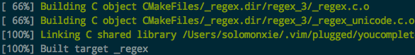

#  ❖ Vim最强自动补全插件Yourcompleteme安装

> YCM是一个很复杂的二进制程序，需要各种编译，很长时间才运行完，很复杂。
看了官方说明后也知道，想要正常使用，需要很长历程。。。

[参考Github ：Valloric/YouCompleteMe](https://github.com/Valloric/YouCompleteMe#installation)


## 第一步：保证所有依赖齐全

目前已知的本机依赖如下（必要）：
- Python3或Python2
- Clang

## 第二步：从将repo克隆到本地

一般可以自己直接`git clone`YCM的源码到本地任意位置。不过为了便于管理，我们用vim插件管理器`Vim-plug`或`Vundle`进行克隆（但是不像别的插件一样可以直接安装完成）

vim-plug管理器中中加入`Plug 'valloric/youcompleteme'`，输入命令`:PlugInstall`。

~重启VIm，然后输入指令，重启YCM服务器：`:YcmRestartServer`~

## 第三步：用YCM自带的一键脚本编译安装相关依赖

进入刚刚克隆的源码目录，执行`install.py`执行最简单的安装：
```sh
cd .vim/plugged/youcompleteme

./install.py--clang-completer
```

如果提示没有`cmake`，则需要自己在本机安装cmake。
Mac上`brew install cmake`即可。

如果提示没有`msbuild or xbuild`，则说明本机没有这个组件。那么最好在`install.py`后面不要加相关的参数，也就是不要用`--all`参数安装所有的组件。

完成后，可以看到100%：



