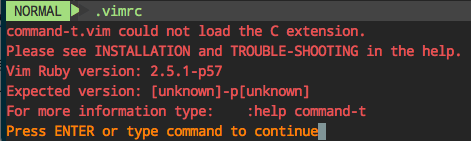
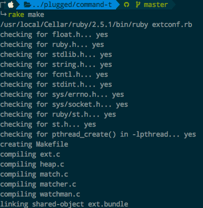
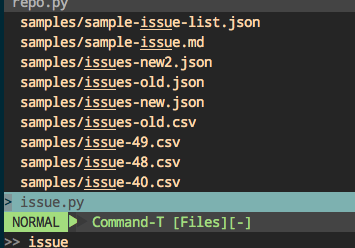

#  ❖ Vim安装command-t文件检索插件

`command-t`是强大快速的文件检索插件，但是需要ruby的支持，配置起来不是那么简单。

建议在`vim-plug`管理器里面安装插件，vundle还没试过。
`vim-plug`中定义如下：
```vim
Plug 'wincent/command-t', {
\   'do': 'cd ruby/command-t/ext/command-t && ruby extconf.rb && make'
\ }
```

然后重启vim后输入`:PlugInstall`安装插件。

启用`command-t`是命令`:CommandT`，或`<leader>t`。但是这时候肯定是还不能运行的，因为没有做ruby支持的检查。



首先在vim中输入`:ruby 1`，看是否报错。如果不报错，则证明已经识别了本机的ruby。
报错的话，则需要在本机安装ruby支持。根据刚才启动command-t时显示的提示信息，安装其`expected version`来安装指定版本的ruby，比如2.5.1。
比如Mac上：
```sh
brew install ruby@2.5.1
```

这时候还不算完，需要在本地编译插件才能使用，这里最简单的是用到`rake`命令：
```sh
# 进入插件目录
cd ~/.vim/plugged/command-t

# 编译插件
rake make
```




安装好后再次到vim中输入命令`:ruby 1`看看是否报错。

如果没有问题的话，就直接输入命令`:CommandT`看看是否会正常弹出文件搜索窗口：



关闭的话，简单的Ctrl+C即可。
