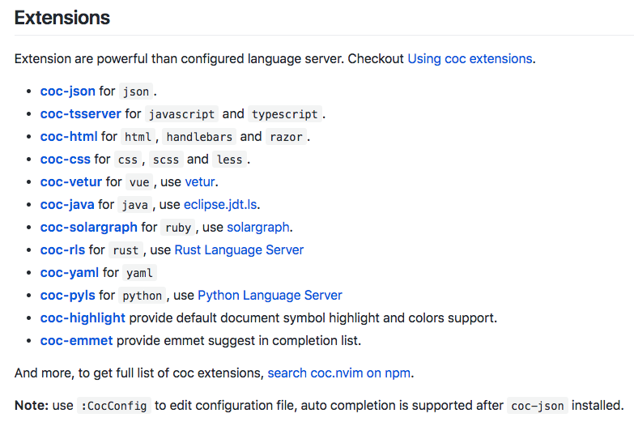
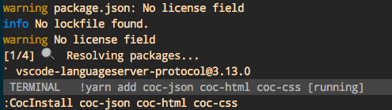

#  ❖ Vim的新一代补全插件：coc.nvim

coc.nvim可以同时在nvim和vim8.1+上使用。


## 安装

[参考官方：Install coc.nvim](https://github.com/neoclide/coc.nvim/wiki/Install-coc.nvim)


推荐使用`vim-plug`插件管理器，在vimrc中添加：
```
Plug 'neoclide/coc.nvim', {'do': { -> coc#util#install()}}
```
然后输入命令`:PlugInstall`

等待插件下载，再等待另一个东西（？）的下载，全部完成后，就会弹出这个网页：
https://github.com/neoclide/coc.nvim/wiki/Using-coc-extensions
即教你安装语言插件的方法。

也就是说，`coc.nvim`只是一个平台，它能够允许你安装各种语言插件，达到不同语言的补全效果。

添加语言插件的vim命令为`CocInstall`。

比如添加python、html、json、css的语言支持，只要在vim中输入命令：
```
:CocInstall coc-pyls coc-json coc-html coc-css 
```

常用插件列表如下：



就会显示下图，即正在安装：



## 配置

[参考官方：Using configuration file](https://github.com/neoclide/coc.nvim/wiki/Using-configuration-file)

coc.nvim有个全局配置文件可以详尽的进行补全和语言配置。


## 使用


