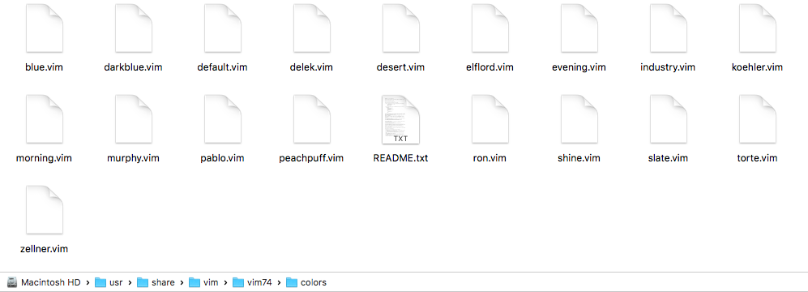
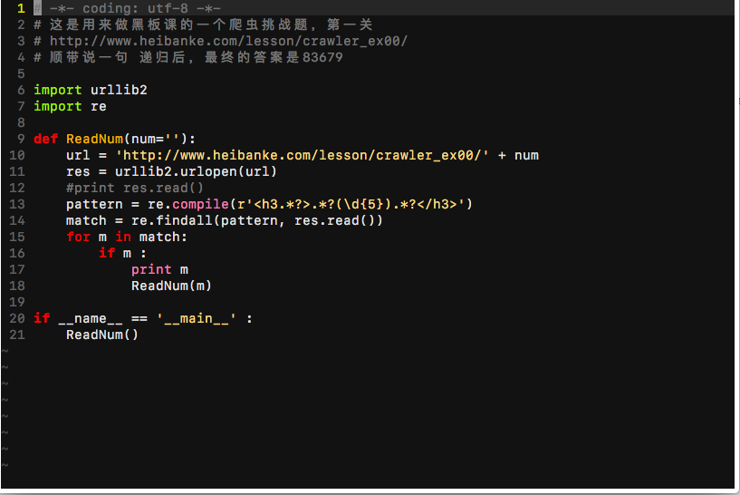

#  ❖ 用VIM的第一步：配置颜色主题 

> 不太明白，为什么很多人学VIM的第一步不是把它弄好看、弄的自己用得舒服，却喜欢一上来就白底黑字的硬搞。

既然都开启了`vimrc`技能，就忍不住好奇心去看看还有什么能配置的。这里就不一一说明了，这个坑太大，配置方案太多。先讲个代表性的配色问题。以下在mac下有效。

vim自带有一些基本的色彩主题，一般在`/usr/share/vim/vim74/colors/`中，如下图：



这个文件夹由于权限原因，不能动。所以要到当前用户的用户文件夹来增加配置文件。一般当前用户是没有这个配置文件夹的，需要自己新建。
```shell
mkdir ~/.vim 
mkdir ~/.vim/colors
```
然后把下载好的色彩主题包中`/colors/`文件夹全部拷贝到`~/.vim/colors/`中就可以使用了。具体操作如下：

### 下载主题包

[参考：vim官方收集的各种主题包：Vim.org色彩主题集](http://www.vim.org/scripts/script_search_results.php?keywords=&script_type=color+scheme&order_by=creation_date&direction=descending&search=search)
[参考：Vim Colors - Online Preview](http://vimcolors.com/)
[下载：Vim colorschemes - one colorscheme pack to rule them all!](https://github.com/flazz/vim-colorschemes)
[下载：我比较喜欢的gruvbox主题](https://raw.githubusercontent.com/morhetz/gruvbox/master/colors/gruvbox.vim)

我这里下载了一个badwolf主题，是zip文件。解压后将主题包里`colors`文件夹内的`.vim`文件直接拷贝到`~/.vim/colors/`中即可。
然后在vim或`.vimrc`文件中输入这两句句话配置就成功了：
```vimrc
colorscheme 色彩主题名称
syntax on
```
效果如下图：




