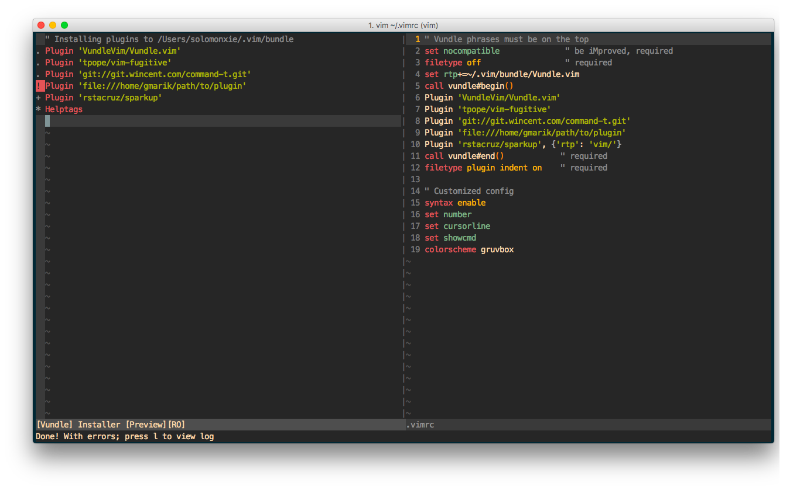

# Vim 安装插件管理器Vundle

安装插件前，一般都会用到`Vundle`这个插件包管理器。它的名字其实是`Vim bundle`的组合。
安装方法可以参考[官网](https://github.com/VundleVim/Vundle.vim)，说的很详细。简单说的话，安装方法如下：
```
git clone https://github.com/VundleVim/Vundle.vim.git ~/.vim/bundle/Vundle.vim
```
然后打开`~/.vimrc`，把下面这段话全部粘贴到文件顶部:
```
" Vundle phrases must be on the top
set nocompatible              " be iMproved, required
filetype off                  " required
set rtp+=~/.vim/bundle/Vundle.vim
call vundle#begin()
    Plugin 'VundleVim/Vundle.vim'
call vundle#end()            " required
filetype plugin indent on    " required
```
其中`Plugin`的部分，可以删除不需要的插件。
保存后，直接在Vim界面里输入这个命令：`:PluginInstall`，或在外部运行`vim -c VundleUpdate -c quitall`。然后vim就会跳转到插件安装界面，并自动下载安装上面列出来的插件。

等到最下面显示`Done!`时，就安装完成了。需要整个退出Vim，再进入，就可以使用了。

## 删除插件

直接在`.vimrc`里把Plugin的那一行删除，然后在vim里运行`:PluginUpdate`即可，然后将`~/.vim/bundle/`下该插件的目录删除。
